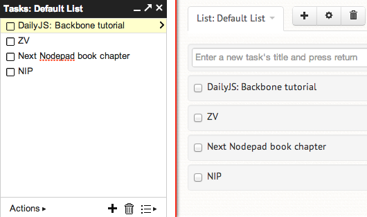
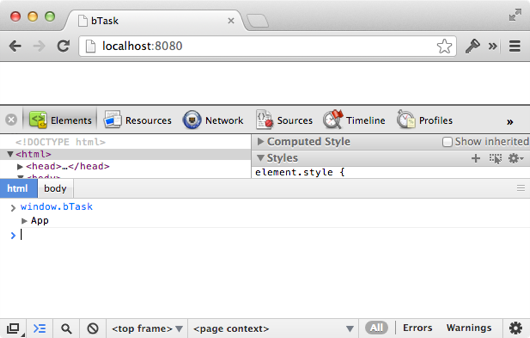
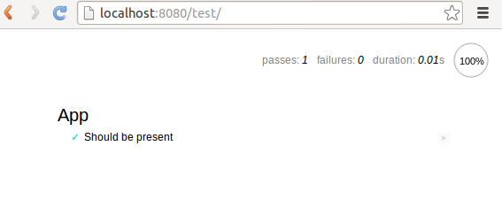

=================
Рабочее окружение
=================

Эта новая серия постов о **Backbone.js** расскажет Вам о построении
одностраничного приложения (**SPA**) с использованием модифицированного
**Backbone.sync**. Приложение, на основе которого будут построены дальнейшие
посты, я начал писать в августе 2012 года. Вот уже несколько месяцев оно
работает без сучка и задоринки. Так что, я думаю, можно «срывать покровы».

Приложение делалось прежде всего для собственных нужд: хотелось более
удобных Gmail TODO списков. Gmail-о подобный интерфейс, мягко говоря,
меня не устраивает, так что я написал ``Backbone.sync`` метод, который
работает с Google API, а поверх него добавил немного **Bootstrap**'а.
Так же, в этой серии я немного расскажу, как кастомизировать Bootstrap.
Ибо нет прощения тем, кто выпускает сайты на голом Bootstrap!

План действий
=============

На протяжении следующих нескольких недель я буду освещать такие темы, как:

  * создание нового node-приложения для построения одностраничного
    приложения (SPA)
  * использование **RequireJS** вместе с **Backbone.js**
  * Google API
  * создание и запуск тестов
  * создание Backbone.js приложения как такового
  * способы *кастомизации Bootstrap*
  * деплой в Dropbox, Amazon S3 или другой аналогичный сервис

Создание рабочего окружения
===========================

Если Вы занимаетесь *client-side* разработкой, то, я думаю, эта часть
будет полезна для Вас. Наша конечная цель — создание окружения для
разработчика, которое позволяло бы выполнять следующее:

  * писать client-side код в виде отдельных файлов
  * объединять различные файлы в нечто, подходящее для деплоймента (упаковка)
  * запускать приложение локально, используя разделённые (неупакованные) файлы
    (для облегчения разработки и отладки)
  * управлять необходимыми node-пакетами
  * запускать тесты
  * всё это делать в Unix и Windows

Чтобы обеспечить всё это, нам понадобятся несколько утилит и библиотек:

  * Node_
  * RequireJS_
  * Grunt_

.. _Node: http://nodejs.org/
.. _RequireJS: http://requirejs.org/
.. _Grunt: http://gruntjs.com/

.. _step-1:

Шаг #1: установка node пакетов
==============================

Создайте новую директорию для этого проекта, а в ней создайте файл с именем
``package.json``:

.. code-block:: bash

    $ mkdir ./backbone-tutorial
    $ cd ./backbone-tutorial
    $ touch package.json

Содержимое файла:

.. code-block:: javascript

    {
      "name": "btask"
    , "version": "0.0.1"
    , "private": true
    , "dependencies": {
        "requirejs": "latest"
      , "connect": "2.7.0"
      }
    , "devDependencies": {
        "mocha": "latest"
      , "chai": "latest"
      , "grunt": "0.3.9"
      , "grunt-exec": "0.3.0"
      }
    , "scripts": {
        "grunt": "node_modules/.bin/grunt"
      }
    }

.. note::

    В оригинальной версии, в ``package.json`` grun/grunt-exec используются
    с версиями "latest", но так как в версии 0.4.x grunt сильно переработали
    пришлось скорректировать версии.

Запустите ``npm install``. После этого, все перечисленные в ``package.json``
модули будут установлены в ``./node_modules``.

Свойство ``private`` защищает Вас от случайной публикации этого пакета. Это
свойство полезно для комерческих проектов с закрытым исходным кодом или для
проектов, которые не подходят для распространения через ``npm``.

Использование ``npm`` оправдано в большистве случаев. Даже если Вы не являетесь
*server-side* разработчиком. Такой подход позволяет достаточно легко включаться
в работу над Вашим проектом другим разработчкам. Таким образом, когда кто-то
хочет присоединиться к Вашему проекту, достаточно сделать ``npm install``,
а не выяснять, что необходимо поставить и куда, чтобы проект заработал.

.. _step-2:

Шаг #2: локальный веб-сервер
============================

Создайте директорию ``app``, а в ней — файл ``app/index.html``:

.. code-block:: bash

    $ mkdir ./app
    $ touch ./app/index.html

Содержимое файла:

.. code-block:: html

    <!DOCTYPE html>
    <head>
      <meta charset="utf-8">
      <title>bTask</title>
      
      
    </head>
    <body>
    </body>
    </html>

После этого необходимо создать файл ``server.js`` в корневом каталоге (рядом
с ``package.json``):

.. code-block:: bash

    $ touch server.js

Содержимое файла:

.. code-block:: javascript

    var connect = require('connect')
      , http = require('http')
      , app
      ;

    app = connect()
      .use(connect.static('app'))
      .use('/js/lib/', connect.static('node_modules/requirejs/'))
      .use('/node_modules', connect.static('node_modules'))
      ;

    http.createServer(app).listen(8080, function() {
      console.log('Running on http://localhost:8080');
    });

В данном примере использована библиотека среднего уровня (*middleware*)
**Connect**, чтобы отдавать во вне файлы из директории ``app/``. Чтобы
добавить другие каталоги, достаточно скопировать строку
``.use(connect.static('app'))`` и заменить в ней ``app`` на нужное значение.

Обратите внимание, как я смапил путь вебсервера ``/js/lib/`` и путь в
файловой системе ``node_modules/requirejs/``. Используя возможности Connect,
я избежал необходимости копирования кода RequireJS туда, где располагаются
*client-side* скрипты. Позже, когда мы доберёмся до сборочных скриптов,
последние будут копировать ``node_modules/requirejs/require.js`` в
``build/js/lib``. Так что не придётся изменять ``index.html``. Такой подход
позволит запустить проект на любом аналогичном веб-сервере или
хостинг-сервисе статических файлов, например на Amazon S3.

Чтобы запустит веб-сервер, наберите ``npm start`` (или ``node server.js``).
После чего по адресу ``http://localhost:8080`` должна отобразиться пустая
страница без каких либо *client-side* ошибок.

Шаг #3: настраиваем RequireJS
=============================

Этот проект будет состоять из модулей, написанных в AMD_ формате. Каждая
Backbone коллекция, модель, представление и т.д. будет находиться в своём
собственном отдельном файле. Кроме самого Backbone объекта, в каждом таком
файле будет храниться список зависимостей, чтобы RequireJS смог загрузить
их при необходимости.

.. _AMD: https://github.com/amdjs/amdjs-api/wiki/AMD

Обычно подобные RequireJS-проекты строят вокруг одного «главного» файла,
который загружает все необходимые зависимости и запускает приложение.
Создайте файл ``app/js/main.js``:

.. code-block:: bash

    $ mkdir app/js
    $ touch app/js/main.js

Со следующим содержимым:

.. code-block:: javascript

    requirejs.config({
      baseUrl: 'js',

      paths: {
      },

      shim: {
      }
    });

    require(['app'],

    function(App) {
      window.bTask = new App();
    });

При выполнении ``require(['app']`` будет загружен файл ``app/js/app.js``,
которого у нас пока нет. Создадим его:

.. code-block:: bash

    $ touch app/js/app.js

Со следующим содержимым:

.. code-block:: javascript

    define([], function() {
      var App = function() {
      };

      App.prototype = {
      };

      return App;
    });

Таким образом, мы получили модуль, написанный в AMD_ формате. Функция
``define`` импортируется из RequireJS и в дальнейшем будет содержать
все внутренние зависимости для проекта.

Чтобы завершить этот шаг, необходимо чтобы ``main.js`` был загружен.
Для этого добавьте в ``app/index.html`` перед тэгом ``</body>``
следующую строчку:

.. code-block:: html

    

Теперь, если обновить страничку по адресу ``http://localhost:8080`` и
открыть JavaScript консоль, можно увидеть, что у нас появился экземпляр
``bTask``.

Шаг #4: тестирование
====================

Всё, что Вы только что узнали из предыдущих трёх шагов, может быть
переиспользовано при создании набора юнит тестов. Mocha_ уже установлена
через ``npm``, так что можно приступать к созданию тестов.

.. _Mocha: http://visionmedia.github.com/mocha/

Создайте новую директорию ``test/`` (на одном уровне с директорией ``app/``).
А в ней — файл ``index.html``:

.. code-block:: bash

    $ mkdir test
    $ touch test/index.html

Содержимое файла:

.. code-block:: html

    <html>
    <head>
      <meta charset="utf-8">
      <title>bTask Tests</title>
      <link rel="stylesheet" href="/node_modules/mocha/mocha.css" />
      
    </head>
    <body>
      

      
      
      
      
      
      
      
      
    </body>
    </html>

Использование ``require`` в самом конце файла, позволяет быть уверенным, что
``mocha.run`` будет запущен только тогда, когда загрузится ``/js/app.js``.

Создадим ещё один файл:

.. code-block:: bash

    $ touch test/setup.js

Со следующим содержимым:

.. code-block:: javascript

    var assert = chai.assert;

    mocha.setup({
      ui: 'tdd'
    , globals: ['bTask']
    });

В этом файле мы делаем доступным ассерт из Chai_ в виде простого ``assert``,
используя который я обычно и пишу свои тесты. Так же, я указал Mocha, что
``bTask`` ожидается в виде глобальной переменной.

.. _Chai: http://chaijs.com/api/assert/

Теперь, вместе со всем этим добром, мы можем начать писать быстрые тесты. Так,
например, создадим ``test/app.test.js``:

.. code-block:: bash

    $ touch test/app.test.js

Со следующим содержимым:

.. code-block:: javascript

    suite('App', function() {
      test('Should be present', function() {
        assert.ok(window.bTask);
      });
    });

Всё, что делает этот тест — это проверяет, что переменная ``window.bTask``
определена. Что, в свою очередь, будет гарантировать, что RequireJS корректно
загрузил приложение.

И наконец, необходимо скорректировать пути, где Connect будет искать тестовые
файлы. Отредактируйте файл ``server.js``, чтобы он принял следующий вид:

.. code-block:: javascript

    var connect = require('connect')
      , http = require('http')
      , app
      ;

    app = connect()
      .use(connect.static('app'))
      .use('/js/lib/', connect.static('node_modules/requirejs/'))
      .use('/node_modules', connect.static('node_modules'))
      .use('/test', connect.static('test/'))
      .use('/test', connect.static('app'))
      ;

    http.createServer(app).listen(8080, function() {
      console.log('Running on http://localhost:8080');
    });

Теперь перезагрузите веб-сервер (см. :ref:`шаг # 2 <step-2>`) и откройте
``http://localhost:8080/test/`` (последний слэш важен). Mocha должна
отобразить, что успешно выполнен 1 тест.

Шаг #5: создание сборок
=======================

Создадим файл ``grunt.js``:

.. code-block:: bash

    $ touch grunt.js

Со следующим содержимым:

.. code-block:: javascript

    module.exports = function(grunt) {
      grunt.loadNpmTasks('grunt-exec');

      grunt.initConfig({
        exec: {
          build: {
            command: 'node node_modules/requirejs/bin/r.js -o require-config.js'
          }
        }
      });

      grunt.registerTask('copy-require', function() {
        grunt.file.mkdir('build/js/lib');
        grunt.file.copy('node_modules/requirejs/require.js',
                        'build/js/lib/require.js');
      });

      grunt.registerTask('default', 'exec copy-require');
    };

Тут используется плагин grunt-exec_ от Jake Harding, который позволяет
запускать комманду из RequireJS, которая создаёт сборку из всего, что
лежит в директории ``app/``. Чтобы сказать RequireJS, что именно необходимо
включать в сборку, создадим файл ``require-config.js``:

.. _grunt-exec: https://github.com/jharding/grunt-exec

.. code-block:: bash

    $ touch require-config.js

Со следующим содержимым:

.. code-block:: javascript

    ({
      appDir: 'app/'
    , baseUrl: 'js'
    , paths: {}
    , dir: 'build/'
    , modules: [{ name: 'main' }]
    })

RequireJS минимизирует и склеит все необходимые файлы. Следующая Grunt-задача
скопирует клиентский код RequireJS в ``build/js/lib/require.js``, так как
наш локальный Connect вервер был настроен на использование именного этого
адреса. Зачем, спросите Вы? Это сделано для того, чтобы в случае обновления
версии RequireJS  через ``npm``, наше приложение и сборки автоматически бы
получали новую версию.

Чтобы запустить Grunt, достаточно сделать ``npm run-script grunt``. ``npm``
комманда ``run-script`` используется для того, чтобы запускать скрипты,
указанные в файле ``package.json`` (см. :ref:`шаг # 1 <step-1>`). Наш
файл ``package.json``, созданный на шаге # 1, содержал строчку:

.. code-block:: bash

    $ grep 'bin/grunt' package.json 
        "grunt": "node_modules/.bin/grunt"

В результате чего и работает вышеуказанная команда ``npm run-script grunt``.
Я предпочитаю такой подход, а не установку Grunt глобально в системе.

Обычно, я не использую Grunt в своих проектах, так как предпочитаю Makefile'ы.
Бесспорно, Makefile для всего вышеописанного был бы очень простым. Но его
использование значительно бы осложнило жизнь разработчикам, которые используют
Windows. Так что использование Grunt в данном примере обосновано лишь желанием
обспечить поддержку Windows. Кроме того, если Вы обычно занимаетесь client-side
разработкой, то Grunt будет значительно легче понять, чем `GNU Make`_ или
любой другой эквивалетный код на Node (у Node есть хороший модуль для файловой
системы).

.. _GNU Make: http://www.gnu.org/software/make/

Резюме
======

В этом уроке Вы создали окружение для сборок Backbone.js проектов, использующих
Mocha_ для тестирования, основанное на Grunt_ и RequireJS_. Так же Вы увидели,
как с помощью Connect можно сделать удобный локальный веб-сервер.

Вцелом, именно так я собираю и все мои одностраничные Backbone.js проекты.
Да, кода  было написано не много. Но используя такой подход, как Вы увидите
в следующих постах, мы обеспечили себе отличную базу для использования вместе
Backbone.js и RequireJS.
