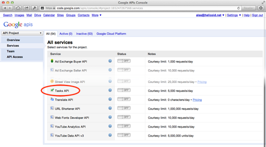
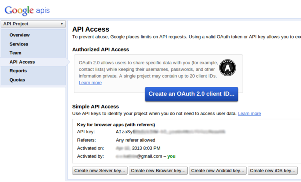
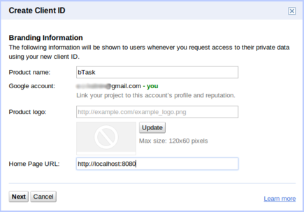
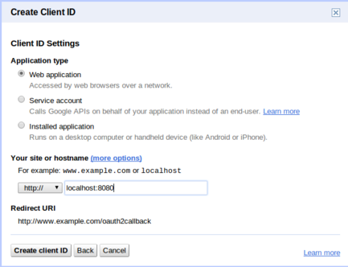
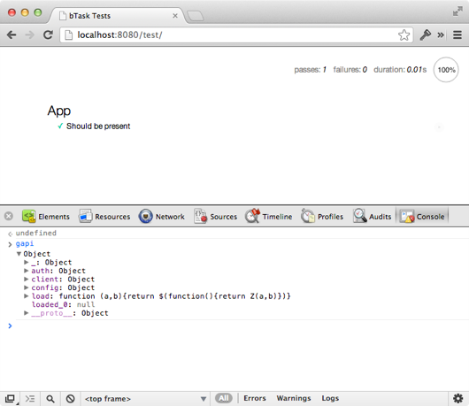

======================
Google API и RequireJS
======================

В части :doc:`backbone-tutorial-1` я объяснял, как сделать простой Node-сервер,
чтобы хостить Ваше Backbone.js приложение и набор юнит тестов. Некоторых
смутил мой способ использования относительных путей, который привел тому,
что тесты могли завершиться неудачно, если не перейти по адресу ``/test/``
(``/test`` не будет работать). Для такого шага были причины: изначально
я разрабатывал это приложение так, чтобы можно было запускать из Dropbox'а,
поэтому я и использовал относительные пути. Вероятно, более безопасно
использовать абсолютные пути, и мне, конечно, следовало бы, сразу прояснить
ситуацию.

В этой части Вы узнаете:

  * как работает ``Backbone.sync``
  * как загружать Backbone.js и Underscore.js с помощью RequireJS
  * как начать работать с Google API

Backbone.sync
=============

Сетевое взаимодействие в Backbone.js хорошо абстрагировано с помощью одного
метода, имеющего следующую сигнатуру:

.. code-block:: javascript

    Backbone.sync = function(method, model, options) {
    };

Входной параметр ``method`` является строкой и может принимать одно из
следующих значений:

  * ``create``
  * ``update``
  * ``delete``
  * ``read``

Внутри, Backbone.js сопоставляет эти значения со следующими HTTP методами:

.. code-block:: javascript

    var methodMap = {
      'create': 'POST',
      'update': 'PUT',
      'delete': 'DELETE',
      'read':   'GET'
    };

Если Вы сталкивались ранее с этим набором методов RESTful API, то всё это
должно быть знакомо для Вас.

Второй параметр ``model`` является экземпляром ``Backbone.Model``, либо
``Backbone.Collection``. Коллекции используются при чтении, когда
возвращается несколькоко значений.

Последний параметр — ``options`` — это объект, содержащий методы обратного
вызова для успешного (success) и неуспешного (error) завершения работы
метода. И всё это добро, в конечном итоге, передаётся в  jQuery Ajax API.

.. _backbone-strucure:

Для того, чтобы начать работать с Google API, нам необходимо написать
собственную реализацию метода ``Backbone.sync``. В общих чертах, наш
метод должен выглядеть следующим образом:

.. code-block:: javascript

    Backbone.sync = function(method, model, options) {
      switch (method) {
        case 'create':
          googleAPI.create(model, options);
        break;

        case 'update':
          googleAPI.update(model, options);
        break;

        case 'delete':
          googleAPI.destroy(model, options);
        break;

        case 'read':
          // The model value is a collection in this case
          googleAPI.list(model, options);
        break;

        default:
          // Something probably went wrong
          console.error('Unknown method:', method);
        break;
      }
    };

Объект ``googleAPI`` — фиктивный, но именно так обычно расширяются возможности
``Backbone.sync``: легкая обертка, которая мапить имена методов и модели на
другой API. "Легкая обертка" означает, что ниже лежащее API (в нашем случае
это ``googleAPI``) может быть без проблем использовано и без Backbone.js.

В нашем случае, Google предоставляет JavaScript API. То есть, как только будет
загружен Google API в нашем окружении появится объект ``gapi.client``.

.. _google-api-console-setup:

Настройка учетной записи для Google API
=======================================

Главная страница для любого, кто хочет иметь дело с Google API — это
`developers.google.com`_. Из всего многообразия, представленного на этой
страницы, нам интереснее всего раздел `Google Tasks API`_, который находится
в разделе Application APIs.

.. _developers.google.com: https://developers.google.com/
.. _Google Tasks API: https://developers.google.com/google-apps/tasks/

Google API разработан таким образом, чтобы одинакого хорошо работать как
на сервере, так и в браузере (client-side JavaScript). Чтобы начать работать
с Google Task API Вам необходимо три вещи:

  * учетная запись в Google (существующая учетная запись тоже подойдет)
  * доступ к консоли Google API (она может быть уже активирована у Вас, если
    Вы ранее когда-либо работали c сервисами Google)
  * API ключ

Чтобы активировать Google API консоль, необходимо посетить страничку
`code.google.com/apis/console`_. После того, как консоль активирована,
необходимо прокрутить страничку вниз до пункта *Task API*:

.. _code.google.com/apis/console: https://code.google.com/apis/console/

.. _google-api-key-setup:

Далее, просто включите переключатель в значение *on* и согласитесь с
условиями предоставления сервиса (если, конечно, Вы с ними согласны).
Далее, необходимо нажать ссылку *API Access* в навигационном меню
слева в верху. После того, как страница загрузится, посмотрите в
блок *Simple API Access*. Нас конкретно интересует строка *Key for browser
apps*. Запомините ее, нам она пригодится чуть позже.

.. _google-client-id-setup:

OAuth 2.0 для client-side приложений
====================================

На той же странице, *API Access*, есть кнопка **Create an OAuth 2.0 client
ID**. Нажмите её. В появившемся окне укажите:

  * Product name: bTask (или любое другое название)
  * Home Page URL: ``http://localhost:8080``

На следующем диалоговом окне убедитесь, что выбрано ``http://``, а не ``https://``.
Введите ``localhost:8080`` и нажимайте «Create client ID».

После этого Вы увидите, что появились новые данные в разделе *Client ID for
web applications*. Поле *Client ID* очень важно для нас. Запомните его.
Мы к нему ещё вернёмся.

Теперь у Вас должны быть *API key* и *Client ID*. Всё это позволит нам
загружать Google API и пользоваться OAuth 2.0 из браузера. Так что, нам не
понадобится писать серверный код для аутентификации пользователей.

Следуйте за мной
================

Если Вы хотите получить код из первой части (:doc:`backbone-tutorial-1`),
то Вы можете воспользоваться git для этого:

.. code-block:: bash

    $ git clone git@github.com:alexyoung/dailyjs-backbone-tutorial.git
    $ cd dailyjs-backbone-tutorial
    $ git reset --hard 2a8517e

Подключаем библиотеки
=====================

Перед тем, как продолжить, необходимо скачать следующие библиотеки в
``app/js/lib/``:

.. code-block:: bash

    $ mkdir -p app/js/lib
    $ cd app/js/lib
    $ wget http://underscorejs.org/underscore-min.js
    $ wget http://backbonejs.org/backbone-min.js

Далее, откройте ``app/js/main.js`` в редакторе и скорректируйте свойство
``shim`` у объекта, передаваемого в ``requirejs.config``, чтобы выполнялась
загрузка Underscore.js и Backbone.js:

.. code-block:: javascript

    requirejs.config({
      baseUrl: 'js',

      paths: {
      },

      shim: {
        'lib/underscore-min': {
          exports: '_'
        },
        'lib/backbone-min': {
          deps: ['lib/underscore-min']
        , exports: 'Backbone'
        },
        'app': {
          deps: ['lib/underscore-min', 'lib/backbone-min']
        }
      }
    });

    require([
      'app'
    ],

    function(App) {
      window.bTask = new App();
    });

На первый взгляд, кажется немного странным. Но вспомните, что мы
используем RequireJS, чтобы загружать скрипты как модули. RequireJS
позволяет реализовывать такие зависимости между библиотеками, которые
невозможно реализовать с помощью AMD.

.. _turn-on-task-api:

Включение Task API
==================

Основная логика для подключения Google Task API следующая:

  * загрузить клиентскую библиотеку Google API:
    ``https://apis.google.com/js/client.js``
  * вызывать ``gapi.client.load``, чтобы загрузить само API для задач
  * установить API key используя ``gapi.client.setApiKey()``

Для того, чтобы это реализовать, необходимо место, где будут храниться все
необходимые пароли/явки. Создадим файл ``app/js/config.js``:

.. code-block:: bash

    $ touch app/js/config.js

И добавим в него ранее созданные API key и Client ID:

.. code-block:: javascript

    define([], function() {
      var config = {};
      config.apiKey = 'your API key';
      config.scopes = 'https://www.googleapis.com/auth/tasks https://www.googleapis.com/auth/userinfo.profile';
      config.clientId = 'your client ID';
      return config;
    });

Этот файл можно загружать с помощью нашей собственной реализации
``Backbone.sync``.

Теперь создадим файл ``app/js/gapi.js``:

.. code-block:: bash

    $ touch app/js/gapi.js

Со следующим содержимым:

.. code-block:: javascript

    define(['config'], function(config) {
      function ApiManager() {
        this.loadGapi();
      }

      _.extend(ApiManager.prototype, Backbone.Events);

      ApiManager.prototype.init = function() {
      };

      ApiManager.prototype.loadGapi = function() {
      };

      Backbone.sync = function(method, model, options) {
        options || (options = {});

        switch (method) {
          case 'create':
          break;

          case 'update':
          break;

          case 'delete':
          break;

          case 'read':
          break;
        }
      };

      return ApiManager;
    });

Эта основа модуля демонстрирует общий принцип загрузки Google Tasks API
и реализацию метода ``Backbone.sync``. ``ApiManager`` — это стандартный
конструктор. Для того, чтобы унаследовать ``ApiManager`` от Backbone.Events,
я использовал возможности Underscore.js. Этот код будет асинхронным, поэтому
обработка событий пригодится нам немного позже.

Метод ``loadGapi`` с помощью RequireJS загружает клиентский JavaScript,
предоставляемый Google API. Как только обнаруживается глобальная переменная
``gapi``, я выполняю остальную часть настройки приложения, вызывая метод
``init``:

.. code-block:: javascript

    ApiManager.prototype.loadGapi = function() {
      var self = this;

      // Don't load gapi if it's already present
      if (typeof gapi !== 'undefined') {
        return this.init();
      }

      require(['https://apis.google.com/js/client.js?onload=define'],
        function() {
            // Poll until gapi is ready
            function checkGAPI() {
              if (gapi && gapi.client) {
                self.init();
              } else {
                setTimeout(checkGAPI, 100);
              }
            }

            checkGAPI();
      });
    };

.. _gapi-client-load:

Всё, что необходимо сделать методу ``init``, это загрузить Tasks API с
помощью ``gapi.client.load``:

.. code-block:: javascript

    ApiManager.prototype.init = function() {
      var self = this;

      gapi.client.load('tasks', 'v1', function() {
          // Loaded
      });

      function handleClientLoad() {
        gapi.client.setApiKey(config.apiKey);
        window.setTimeout(checkAuth, 100);
      }

      function checkAuth() {
        gapi.auth.authorize({
            client_id: config.clientId,
            scope: config.scopes,
            immediate: true },
            handleAuthResult
        );
      }

      function handleAuthResult(authResult) {
      }

      handleClientLoad();
    };

Переменная ``config`` является одной из зависимостей для этого файла. Она
содержит все необходимые ключи, требуемые Google API.

Загрузка API Manager
====================

Теперь откроем ``app/js/app.js`` и сделаем его зависимым от ``gapi``. Затем
создадим экземпляр класса ``ApiManager``:

.. code-block:: javascript

    define([
      'gapi'
    ],

    function(ApiManager) {
      var App = function() {
        this.connectGapi();
      };

      App.prototype = {
        connectGapi: function() {
          this.apiManager = new ApiManager();
        }
      };

      return App;
    });

Если Вы хотите проверить, что всё выше сделанное работает с помощью тестов,
то необходимо скорректировать  ``test/setup.js`` и пометить ``gapi`` как
глобальный объект:

.. code-block:: javascript

    var assert = chai.assert;

    mocha.setup({
      ui: 'tdd'
    , globals: ['bTask', 'gapi', '___jsl']
    });

Однако, я не собираюсь загружать удаленное API во время тестирования, так
как это может быть смоделировано с помощью mock-объектов. Я ещё вернусь
к этому немного позже.

Результаты
==========

Если Вы запустите приложение или тесты, то в JavaScript консоле можно будет
увидеть, что появился глобальный объект ``gapi``. При использовании Google
API вместе с RequireJS и Backbone.js, кажется, что мы делаем много всего.
Однако, большинство из всего, что мы пока сделали — это всего лишь настройка.
И как только мы закончим эту настройку, приложение должно работать достаточно
стабильно, чтобы Вы могли сосредоточиться на дизайне самого приложения и
разработке его возможностей.

Ссылки
======

  * `Использование OAuth 2.0 для client-side приложений <https://developers.google.com/accounts/docs/OAuth2UserAgent>`_
