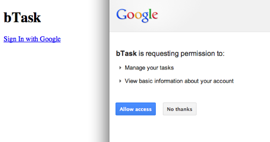
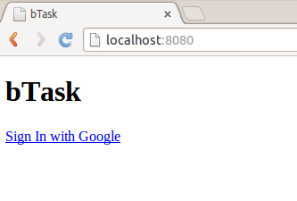

==================================
Аутентификация с помощью OAuth 2.0
==================================

В предыдущей части :doc:`backbone-tutorial-2` я заложил фунамент для работы с
Google JavaScript API. Сейчас мы готовы начать работать с ``todo`` API. Но
сначала необходимо научиться запрашивать учётную запись.

Подготовка
==========

Перед началом этого поста Вам понадобится:

  * `dailyjs-backbone-tutorial <https://github.com/alexyoung/dailyjs-backbone-tutorial>`_,
    коммит ``9d09a66b1f``
  * API Key из предыдущей части
  * Client ID из предыдущей части
  * обвноленный ``app/js/config.js`` с Вашими ключами

Чтобы получить исходный код, выполните следующую команду (или используйте
подходящую Git UI утилиту):

.. code-block:: bash

    $ git clone git@github.com:alexyoung/dailyjs-backbone-tutorial.git
    $ cd dailyjs-backbone-tutorial
    $ git reset --hard 9d09a66b1f

Google’s OAuth 2.0 Client-side API
==================================

Откройте ``app/js/gapi.js`` и взгляните на строки `11-25
<https://github.com/alexyoung/dailyjs-backbone-tutorial/blob/9d09a66b1f722ebf80198a8db76dd32a7b4a6923/app/js/gapi.js#L11-L25>`_.
Там присутствует метод ``gapi.auth.authorize``, предоставляемый Google. При
попытке аутентифицировать пользователя, в этот метод передаётся «Client ID» и
некие области видимости. Области видимости я уже установил ранее в
``app/js/config.js``:

.. code-block:: javascript

    config.scopes = 'https://www.googleapis.com/auth/tasks https://www.googleapis.com/auth/userinfo.profile';

Такие значения сообщают системе аутентификации, что наше приложение захочет
получить доступ к пользовательскому профилю и к Gmail задачам. Уже почти
всё готово к работе. Но мы пока упустили 2 вещи: реализацию
метода ``handleAuthResult`` и пользовательского интерфейса.

Настройка шаблонов
==================

RequireJS способен загружать шаблоны с помощью `text <https://github.com/requirejs/text>`_
плагина. Так что, скачиваем `text.js <https://raw.github.com/requirejs/text/master/text.js>`_
c GitHub'a и сохраняем в ``app/js/lib/text.js``:

.. code-block:: bash

    $ wget -O app/js/lib/text.js \
        https://raw.github.com/requirejs/text/master/text.js

Я предпочитаю именно этот метод работы с шаблонами. Хотя для этого приложения
вполне можно было бы «уложить» все шаблоны в монолитный ``index.html``. Но
для долгоиграющих проектов, гораздо удобнее разбить проект на небольшие шаблоны.
Так что, мне кажется, это хорошая идея, использовать в нашем примере «правильный»
подход.

А теперь откройте ``app/js/main.js`` и добавьте ``text`` плагин в свойство ``paths``:

.. code-block:: javascript

    paths: {
      text: 'lib/text'
    },

И наконец, добавьте это в ``app/js/config.js`` прямо перед ``return config;``:

.. code-block:: javascript

    _.templateSettings = {
      interpolate: /\{\{(.+?)\}\}/g
    };

Это укажет шаблонному движку Underscore, что для вставки значений необходимо
использовать двойный фигурные скобки.

Теперь приложению понадобятся несколько дополнительных директорий для
хранения шаблонов:

  * ``app/js/views`` — это для представлений Backbone.js
  * ``app/js/templates`` — простые HTML шаблоны, для загрузки из представлений
  * ``app/css``

Создадим их:

.. code-block:: bash

    $ mkdir app/js/views
    $ mkdir app/js/templates
    $ mkdir app/css

Добавим в файл ``app/index.htm`` ссылку для загрузки CSS:

.. code-block:: html

    <link rel="stylesheet" href="css/app.css">

И создадим сам CSS файл ``app/css/app.css``:

.. code-block:: css

    #sign-in-container, #signed-in-container { display: none }

Таким образом, приложение при старте будет скрывать и основной контент
и кнопку входа. OAuth API будет запрашиваться для существующих учётных
записей. Если пользователь уже логинился ранее, то информация об этом
будет храниться в куках (cookies). Так что надо будет не забыть
сконфигурировать представления соответствующим образом.

Шаблоны
=======

На данном этапе шаблоны не представляют из себя ничего примечательного,
так что просто добавьте этот код в ``app/js/templates/app.html``:

.. code-block:: html

    

      

        <h1>bTask</h1>
        

      

      

        <small class="pull-right" id="profile-container"></small>
        

          

          

            
You're signed in!

          

        

      

    

В этом шаблоне показаны некоторые элементы, которые мы пока использовать не
будем. Пока просто игнорируйте их и сфокусируйтесь на элементах
``sign-in-container`` и ``signed-in-container``.

Далее, вставьте следующий фрагмент в файл ``app/js/templates/auth.html``:

.. code-block:: html

    <a href="#" id="authorize-button" class="btn btn-primary">
        Sign In with Google
    </a>

Шаблон ``auth.html`` будет вставлятья в элемент ``sign-in-container``. На
данный момент всё выглядит очень просто. Я добавил этот шаблон только для
того, чтобы продемонстрировать работу с представлениями Backbone.js.

Представления Backbone.js
=========================

Чтобы управлять созданными шаблонами, нам понадобятся соответствующие
Backbone.js представления. В этом разделе будет показано, как загружать
шаблоны с помощью RequireJS и отрисовывать их. Создайте файл
``app/js/views/app.js``:

.. code-block:: javascript

    define([
      'text!templates/app.html'
    ],

    function(template) {
      var AppView = Backbone.View.extend({
        id: 'main',
        tagName: 'div',
        className: 'container-fluid',
        el: 'body',
        template: _.template(template),

        events: {
        },

        initialize: function() {
        },

        render: function() {
          this.$el.html(this.template());
          return this;
        }
      });

      return AppView;
    });

У класса ``AppView`` пока нет никаких собыйтий, но он уже связан с элементом
``body`` и загружает шаблон: ``define(['text!templates/app.html']``. Директива
``text!`` предоставляется плагином «text» для RequireJS, который мы добавили
ранее. Шаблон представляет из себя строку, в которой содержится необходимый
HTML. Он отрисовывается с помощью связывания его с классом ``Backbone.View``
и вызывова метода ``html()`` из jQuery: ``this.$el.html(this.template());``.

Класс ``AuthView`` немного отличается. Создадим файл ``app/js/views/auth.js``:

.. code-block:: javascript

    define(['text!templates/auth.html'], function(template) {
      var AuthView = Backbone.View.extend({
        el: '#sign-in-container',
        template: _.template(template),

        events: {
          'click #authorize-button': 'auth'
        },

        initialize: function(app) {
          this.app = app;
        },

        render: function() {
          this.$el.html(this.template());
          return this;
        },

        auth: function() {
          this.app.apiManager.checkAuth();
          return false;
        }
      });

      return AuthView;
    });

При создании экземпляра ``AuthView`` (это будет сделано немного позже с
помощью ``new AuthView(this)``) объект ``app`` передается в функцию
``initialize``. Это сделано для того, чтобы предоставить возможность
представлению вызывать необходимый метод аутентификации из ``ApiManager``.
Это можно было так же реализовать с помощью событий или ещё многими
другими способами. Я просто хотел показать, как мы можем создавать экземпляры
представлений и передавать в них параметры, как в любые другие классы.

Ядро приложения
===============

Для каждого представления Backbone.js должен быть создан экземпляр класса,
каждый из которых, в свою очередь, должен быть отрисован. Откройте файл
``app/js/app.js`` и скорректируйте его так, чтобы с помощью RequireJS
загружались созданные ранее представления:

.. code-block:: javascript

    define([
      'gapi'
    , 'views/app'
    , 'views/auth'
    ],

    function(ApiManager, AppView, AuthView) {

      var App = function() {
        this.views.app = new AppView();
        this.views.app.render();

        this.views.auth = new AuthView(this);
        this.views.auth.render();

        this.connectGapi();
      };

      App.prototype = {
        views: {},

        connectGapi: function() {
          this.apiManager = new ApiManager(this);
        }
      };

Остальная часть файла осталась такой же, какой и была. Обратите внимание,
что порядок, в котором создаются экземпляры представлений, очень важен:
``AuthView`` не будет работать, пока не станут доступными тэги, объявленные
в ``AppView``. Возможно, было бы лучше, если бы мы переместили ``AuthView``
внутрь ``AppView``. Вы можете попробовать сделать это сами, если захотите
поэкспериментировать.

Реализация аутентификации
=========================

В файле ``app/js/gapi.js`` до сих пор не реализована функция
``handleAuthResult``. Так что пока ничего не работает. Вот код,
реализующий аутентификацию:

.. code-block:: javascript

    function handleAuthResult(authResult) {
      var authTimeout;

      if (authResult && !authResult.error) {
        // Schedule a check when the authentication token expires
        if (authResult.expires_in) {
          authTimeout = (authResult.expires_in - 5 * 60) * 1000;
          setTimeout(checkAuth, authTimeout);
        }

        app.views.auth.$el.hide();
        $('#signed-in-container').show();
      } else {
        if (authResult && authResult.error) {
          // TODO: Show error
          console.error('Unable to sign in:', authResult.error);
        }

        app.views.auth.$el.show();
      }
    }

    this.checkAuth = function() {
      gapi.auth.authorize({
          client_id: config.clientId,
          scope: config.scopes,
          immediate: false },
          handleAuthResult);
    };

Основная сложность при реализации процедуры входа — это определить, когда
пользователь уже залогинен. Если так, процесс аутентификации должен пройти
прозрачно для пользователя и никаких лишних вопросов быть не должно. Если
же пользователь ещё не входил, то ему должно быть показано окно авторизации.

Функция ``handleAuthResult`` вызывается через ``gapi.auth.authorize`` из
функции ``checkAuth``, которая тут не показана (если Вы вдруг захотите
проверить, то в исходниках она находится прямо перед ``handleAuthResult``).
Метод ``this.checkAuth`` — другой. Это публичный метод, который вызывает
``gapi.auth.authorize`` с параметром ``immediate`` установленным в значение
``false``. В то время, как в ``checkAuth`` для этого параметра установлено
значение ``true``.

Опция ``immediate`` очень важна, так как она определяет будет ли показано
всплывающее окно или нет. Я использовал её для того, чтобы проверить, залогинен
пользователь или нет. Если нет, то она вызывается ещё раз, но со значением
``immediate: false``. В результате чего будет показано всплывающее окно,
в котором пользователь увидит, какие права доступа собирается использовать
приложение:

Я использовал такой подход, основываясь на документации к `Google APIs Client
Library for JavaScript <http://code.google.com/p/google-api-javascript-client/wiki/Authentication>`_:

    «Стандартный метод authorize() всегда показывает всплывающее окно, что может
    немного раздражать, если вы пытаетесь лишь обновить OAuth 2.0 токен.
    Реализация Google OAuth 2.0 поддерживает режим "immediate", который обновляет
    токен без всплывающего окна. Чтобы воспользоваться этим режимом, просто
    добавьте "immediate: true" в конфигурацию логина, как это показано на
    примере выше.»

Я так же изменил класс ``ApiManager``, чтобы хранить ссылку на ``App``:

.. code-block:: javascript

    // где-то в начале gapi.js
    var app;

    function ApiManager(_app) {
      app = _app;
      this.loadGapi();
    }

Чтобы проверить наши доработки, делаем ``node server.js`` и идём проверять
работу на http://localhost:8080. Должна быть вот такая картинка:

Обратите внимание, что ссылка ``Sign in with Google`` появляется не сразу,
а после того, как загрузится соответствующий javascript с серверов Google.

Итоги
=====

В этом уроке Вы увидели, как пользоваться Google API для входа в приложение,
которое Вы ранее зарегистрировали в Google API Console (см.
:ref:`часть 2 <google-api-console-setup>`). Может показаться, что мы уже
сделали очень много всего, чтобы заставить работать вместе RequireJS,
Backbone.js и Google OAuth. Но подумайте о результате: 100%-но клиентское
приложение, которое может аутентифицировать пользователей с помощью
существующих учетных записей в Google.

Все изменения — `одной пачкой <https://github.com/alexyoung/dailyjs-backbone-tutorial/commit/c1d5a2e7ccadf82289676e6dd4fead9b1e311435>`_.
