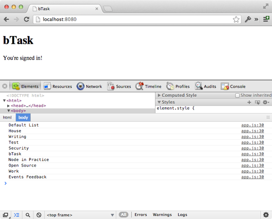

=============
Backbone.sync
=============

Подготовка
==========

Перед началом этого урока, Вам понадобится cледующее:

  * `alexyoung/dailyjs-backbone-tutorial <https://github.com/alexyoung/dailyjs-backbone-tutorial>`_
    коммит ``c1d5a2e7cc``
  * API key из :ref:`части 2 <google-api-key-setup>`
  * Client ID из :ref:`части 2 <google-client-id-setup>`
  * обновить ``app/js/config.js`` полученными значениями (если Вы зачекаутили мой репо)

Чтобы получить исходный код, выполните следующую команду (или используйте
подходящую Git UI утилиту):

.. code-block:: bash

    $ git clone git@github.com:alexyoung/dailyjs-backbone-tutorial.git
    $ cd dailyjs-backbone-tutorial
    $ git reset --hard c1d5a2e7cc

Google Task API
===============

Напоминаю, что суть этой серии постов в том, чтобы сделать одностраничное
Backbone.js приложение, которое использует client-side javascript для
взаимодействия с аутентификацией и Todo API от Google. Это понятно? Хорошо!

Google предоставляет доступ к нашим todo спискам с помощью двух API:

  * `Списки задач <https://developers.google.com/google-apps/tasks/v1/reference/tasklists#resource>`_
  * `Задачи <https://developers.google.com/google-apps/tasks/v1/reference/tasks>`_

После того, как загружается javascript от Google в браузере появляется
глобальный объект ``gapi``, предоставляющий доступ к различным объектам
и методам. Во :ref:`второй части <gapi-client-load>` я добавил вызов
``gapi.client.load``, который загружает ``tasks`` API:

.. code-block:: javascript

    gapi.client.load('tasks', 'v1', function() {
        // Loaded
    });

Этот блок находится в файле ``app/js/gapi.js``. Всё, что нам осталось
реализовать, перед тем, как начать заниматься интерфейсом, это реализовать
метод ``Backbone.sync``, который использует ``gapi``, чтобы «общаться» с
API задач и списков задач.

Структура Backbone.sync
=======================

Я уже :ref:`описывал ранее <backbone-strucure>` общую структуру метода
``Backbone.sync``. Подход, который я при этом использовал, достаточно общий,
так что Вы можете использовать аналогичный подход при работе с любым другим
API, отличным Google API.

Метод ``sync`` принимает 3 параметра, первым из которых является ``method``
(``create``, ``update``, ``delete`` и ``read``). Мы должны смапить ``method``
на что-то, что будет понятно для Google API.

Вот, что у нас сейчас есть:

.. code-block:: javascript

    Backbone.sync = function(method, model, options) {
      options || (options = {});

      switch (method) {
        case 'create':
        break;

        case 'update':
        break;

        case 'delete':
        break;

        case 'read':
        break;
      }
    };

Методы из Google Tasks API можно смапить с ``method`` из Backbone.js
приблизительно следующим образом:

================    ===================     =============================
Google Tasks API    Backbone.sync метод     Описание
================    ===================     =============================
``insert``          ``create``              Создание новой задачи
``update``          ``update``              Изменение сущестующей задачи
``delete``          ``delete``              Удаление задачи
``list``            ``read``                Получение списка задач
================    ===================     =============================

И хотя Google API не выглядят, как Rails 3-подобное RESTful API, как
например, Backbone.js выглядит «из коробки», они очень похожи.

Делаем запросы с помощью ``gapi``
=================================

Объект ``gapi`` выполняет запросы, используя следующий шаблон:

  * вызвать один из методов ``gapi.client.tasks``, передавая в
    *request content* объект ``request``
  * вызвать ``request.execute`` с функцией обратного вызова, чтобы
    послать запрос
  * функция обратного вызова получает объект ``response``. Всё, как
    в стандартном Ajax запросе

А вот, как он выглядит в реальности:

.. code-block:: javascript

    var requestContent = {}
     , request
     , gapiResource;

    gapiResource = 'tasks';
    requestContent['tasklist'] = tasklistId; // Предполгаем, что он у нас есть
    requestContent['resource'] = model.toJSON();

    // 'insert' используется для создания новой задачи
    request = gapi.client.tasks[gapiResource].insert(requestContent);

    // Отправка запроса к API
    request.execute(function(res) {
          // Handle the response
    });

Глядя на всё это, становится ясно, что нам нужны две модели: ``Task`` и
``TaskList``. Так же понадобятся две соответствующие коллекции: ``Tasks``
и ``TaskLists``.

Модели и коллекции Backbone имеют свой URL, чтобы быть способными выполнять
запросы к API. Так же и Google API имеет свои аналогичные URL: ``tasks`` и
``tasklists``. Так что, используя  URL модели, ``Backbone.sync`` сможет
определить, какой источник API требуется для каждого запроса.

Модели
======

Создадим новую директорию ``app/js/models`` и добавим туда файл ``task.js``:

.. code-block:: bash

    $ mkdir app/js/models
    $ touch app/js/models/task.js

Со следующим содержимым:

.. code-block:: javascript

    define(function() {
      var Task = Backbone.Model.extend({
        url: 'tasks'
      });

      return Task;
    });

А так же создадим файл ``app/js/models/tasklist.js``:

.. code-block:: bash

    $ touch app/js/models/tasklist.js

Со следующим содержимым:

.. code-block:: javascript

    define(function() {
      var TaskList = Backbone.Model.extend({
        url: 'tasklists'
      });

      return TaskList;
    });

Колллекции
==========

Создадим ещё одну директорию ``app/js/collections`` и файл в ней
``tasklists.js``:

.. code-block:: bash

    $ mkdir app/js/collections
    $ touch app/js/collections/tasklists.js

Со следующим содержимым:

.. code-block:: javascript

    define(['models/tasklist'], function(TaskList) {
      var TaskLists = Backbone.Collection.extend({
        model: TaskList
      , url: 'tasklists'
      });

      return TaskLists;
    });

Коллекцию ``TaskList`` мы будем использовать немного позже для загрузки
списка дел.

Выполняем запросы к API
=======================

Откройте файл ``app/js/gapi.js`` и добавьте новую строчку после 36 строки:

.. code-block:: javascript

    app.views.auth.$el.hide();
    $('#signed-in-container').show();
    self.trigger('ready'); // Вот эту

Событие ``ready`` будет означать, что аутентификация прошла успешно и Task API
готово к использованию. Далее, необходимо добавить пару строчку в
``Backbone.sync``: внутрь ветки ``read`` в case:

.. code-block:: javascript

    case 'read':
      var request = gapi.client.tasks[model.url].list(options.data);
      Backbone.gapiRequest(request, method, model, options);
    break;

Тут создаётся запрос, после чего ``Backbone.gapiRequest`` выполняет его и
делегирует обработку запроса.

Вот базовая версия метода ``Backbone.gapiRequest``:

.. code-block:: javascript

    Backbone.gapiRequest = function(request, method, model, options) {
      var result;
      request.execute(function(res) {
        if (res.error) {
          if (options.error) options.error(res);
        } else if (options.success) {
          result = res.items;
          options.success(result, true, request);
        }
      });
    };

Добавим этот код в файл ``app/js/gapi.js`` прямо перед ``return ApiManager;``.

Всё, что делает этот метод — это запуск ``request.execute``, который
предоставляет Google, после чего делает полученный ответ совместимым
с Backbone API, выполняя либо ``success``, либо ``error`` функции
обратного вызова.

Чтобы Вы смогли увидеть, что что-то действительно происходит, откройте
``app/js/app.js`` и сделайте так, чтобы загружалась коллекция ``TaskLists``,
скорректировав вызов ``define`` в начале файла:

.. code-block:: javascript

    define([
      'gapi'
    , 'views/app'
    , 'views/auth'
    , 'collections/tasklists'
    ],

    function(ApiManager, AppView, AuthView, TaskLists) {

В конструкторе ``App`` добавляем создание коллекции списков:

.. code-block:: javascript

    var App = function() {
      this.views.app = new AppView();
      this.views.app.render();

      this.views.auth = new AuthView(this);
      this.views.auth.render();

      // вот эту строчку
      this.collections.lists = new TaskLists();

      this.connectGapi();
    };

.. _add-ready-event-handler:

А чуть ниже, в том же файле, добавьте вот это в метод ``connectGapi``, чтобы
``App.prototype`` принял следующий вид (так же добавляется переменная
``collections``):

.. code-block:: javascript

    App.prototype = {
      views: {},
      collections: {},

      connectGapi: function() {
        var self = this;
        this.apiManager = new ApiManager(this);
        this.apiManager.on('ready', function() {
          self.collections.lists.fetch({ data: { userId: '@me' }, success: function(res) {
            _.each(res.models, function(model) {
              console.log(model.get('title'));
            });
          }});
        });
      }
    };

Тут используется метод ``each`` из Underscore, чтобы пройтись по каждой
модели, которую возвратил ``Backbone.sync``, который вызывается из
коллекции ``TaskList``.

Теперь откройте консоль, запустите сервер с помощью ``npm start`` и откройте
http://localhost:8080. Если Вы открыли страницу, в браузере, в котором есть
javascript console, то должны увидеть следующее:

Если у Вас получилась что-то похожее, то Вы уже не далеки от того, чтобы
сделать настроящее Backbone.js приложение, работающее с Google API. Такой
же подход может быть использован и для других Google API.

Итоги
=====

Все изменения — `одной пачкой <https://github.com/alexyoung/dailyjs-backbone-tutorial/commit/fcd653ec6fa5916246e3f8b9b5f942f4be31d2e7>`_.
