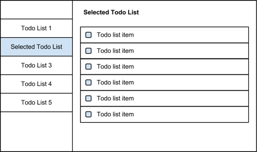

================
Просмотр списков
================

Подготовка
==========

Перед началом этого урока, Вам понадобится cледующее:

  * `alexyoung/dailyjs-backbone-tutorial <https://github.com/alexyoung/dailyjs-backbone-tutorial>`_
    коммит ``fcd653ec6``
  * API key из :ref:`части 2 <google-api-key-setup>`
  * Client ID из :ref:`части 2 <google-client-id-setup>`
  * обновить ``app/js/config.js`` полученными значениями (если Вы зачекаутили мой репо)

Чтобы получить исходный код, выполните следующую команду (или используйте
подходящую Git UI утилиту):

.. code-block:: bash

    $ git clone git@github.com:alexyoung/dailyjs-backbone-tutorial.git
    $ cd dailyjs-backbone-tutorial
    $ git reset --hard fcd653ec6

Каркас
======

Создаваемое нами приложение имеет несколько основных элементов интерфейса:

  * двух колоночное расположение для показа списков задач и самих задач
  * формы для добавления и редактирования задач
  * кнопки для вызова форм, удаления элементов и очистки сделанных задач
  * чекбокс, отображающий состояние задачи (сделано или нет)

Картинка ниже демонстрирует базовое расположение элементов:

В этом посте мы начнём реализацию интерфейса, используя несортированный
список для отображения списков задач.

Элементы списков
================

Несмотря на относительную простоту, реализация навигабельных списков задач
требует использования нескольких элементов Backbone.js:

  * HTML шаблоны
  * Backbone представления: ``ListMenuView``, ``ListMenuItemView``
  * Backbone коллекции: ``TaskLists``

Предтавление ``ListMenuView`` содержит меню списка задач, а представление
``ListMenuItemView`` — элемент навигации для каждого списка задач. Оно
может быть реализовано с помощью ``ul`` и множества ``li`` элементов.

Для хранения ``Backbone.View`` классов, связанных со списками задач,
создадим новую директорию ``app/js/views/lists``. А для хранения
соответствующих шаблонов, создадим директорию ``app/js/templates/lists``:

.. code-block:: bash

    $ mkdir app/js/views/lists
    $ mkdir app/js/templates/lists

.. _listmenuview:

Представление ``ListMenuView``
==============================

Это представление расположено в файле ``app/js/views/lists/menu.js``:

.. code-block:: bash

    $ touch app/js/views/lists/menu.js

Со следующим содержимым:

.. code-block:: javascript

    define(['views/lists/menuitem'], function(ListMenuItemView) {
      var ListMenuView = Backbone.View.extend({
        el: '.left-nav',
        tagName: 'ul',
        className: 'nav nav-list lists-nav',

        events: {
        },

        // пока этот метод тут не нужен, так как никакой пользы
        // пока не приносит, но вместо этого добавляет баг:
        // при добавлении каждого нового элемента в коллекцию
        // все списки отрисовываются заново, что приводит
        // к задаиванию/затраиванию и т.д. списков
        //initialize: function() {
        //  this.collection.on('add', this.render, this);
        //},

        render: function() {
          // TODO
        }
      });

      return ListMenuView;
    });

В представлении загружается ``views/lists/menuitem``, который мы создадим
чуть позже. Затем, оно связывает себя с элементом ``.left-nav``, который
был создан в соответствующем шаблоне ``AppView``. Меню представляет из
себя несортированный список и использует имена классов, которые пока ничего
не значат и станут более осмысленными после добавления css.

Обратите внимание, что представление ожидает коллекцию. Коллекция может
быть передана в представление во время создания экземпляра класса.
Например, ``new ListMenuView({ collection: lists })``.

Метод ``render`` должен выглядеть так:

.. code-block:: javascript

    render: function() {
      var $el = $(this.el)
        , self = this;

      this.collection.each(function(list) {
        var item, sidebarItem;
        item = new ListMenuItemView({ model: list });
        $el.append(item.render().el);
      });

      return this;
    }

Элемент текущего представления является контейнером для каждого представления
``ListMenuItemView``. Итерируясь по элементам коллекции, создаётся по одному
представлению ``ListMenuItemView`` для каждой модели в коллекции. При этом
каждая модель передаётся в представление при создании экземпляра представления.

Представление ``ListMenuItemView``
==================================

Представление расположено в файле ``app/js/views/lists/menuitem.js`` и схоже
с предыдущим представлением:

.. code-block:: bash

    $ touch app/js/views/lists/menuitem.js

Но при этом использует шаблоны и декларативное связывание событий:

.. code-block:: javascript

    define(['text!templates/lists/menuitem.html'], function(template) {
      var ListMenuItemView = Backbone.View.extend({
        tagName: 'li',
        className: 'list-menu-item',

        template: _.template(template),

        events: {
          'click': 'open'
        },

        initialize: function() {
          this.model.on('change', this.render, this);
          this.model.on('destroy', this.remove, this);
        },

        render: function() {
          var $el = $(this.el);
          $el.data('listId', this.model.get('id'));
          $el.html(this.template(this.model.toJSON()));
          return this;
        },

        open: function() {
          var self = this;
          return false;
        }
      });

      return ListMenuItemView;
    });

Создадим сам шаблон:

.. code-block:: bash

    $ touch app/js/templates/lists/menuitem.html

Со следующим содержимым:

.. code-block:: html

    <a href="#" class="list-title" data-list-id="{{id}}">{{title}}</a>

Обратите внимание, что для вставки значений используются фигурные скобки.
Эта возможность предоставляется встроенным в Underscore шаблонизатором.

Метод представления ``open`` связывается с событием ``click``. Так же я
связал события модели ``change`` и ``destroy`` с представлением. Чуть
позже это нам пригодится.

Значения переменных в шаблонах заполняются с использованием метода
``template`` в методе ``render``:

.. code-block:: javascript

    $el.html(this.template(this.model.toJSON()));

JSON объект, полученный из модели, передаётся в ``template``, так что ``title``
и ``id`` будут заполнены соответствующими значениями из модели.

Использование ``ListMenuView``
==============================

Откройте ``app/js/app.js`` и добавьте ``ListMenuView`` в список зависимостей
``define``:

.. code-block:: javascript

    define([
      'gapi'
    , 'views/app'
    , 'views/auth'
    , 'views/lists/menu'
    , 'collections/tasklists'
    ],

    function(ApiManager, AppView, AuthView, ListMenuView, TaskLists) {

В :ref:`прошлом уроке <add-ready-event-handler>` я добавил вызов
``console.log``, чтобы напечатать в консоле имена списков.  Удалите тот
код и замените его на следующий, который будет отрисовывать ``ListMenuView``:

.. code-block:: javascript

    connectGapi: function() {
      var self = this;
      this.apiManager = new ApiManager(this);
      this.apiManager.on('ready', function() {
        self.collections.lists.fetch({ data: { userId: '@me' }, success: function(res) {
          self.views.listMenu.render();
        }});
      });
    }

Теперь вернитесь в конструктор ``App`` и добавьте создание инстанса
``listMenu``:

.. code-block:: javascript

    var App = function() {
      this.views.app = new AppView();
      this.views.app.render();

      this.views.auth = new AuthView(this);
      this.views.auth.render();

      this.collections.lists = new TaskLists();
      this.views.listMenu = new ListMenuView({
          collection: this.collections.lists
      });

      this.connectGapi();
    };

Запускаем
=========

Теперь, если Вы выполните команду ``node server`` и откроете страницу
``http://127.0.0.1:8080``, Вы должны увидеть списки задач в простом
несортированном списке.

Итоги
=====

Теперь наше приложение взаимодействует с Google, позволяет пользователям
выполнть вход и отображает списки дел пользователя. Пока, конечно, наше
приложение не выглядит потрясающе, так как мы не добавляли никаких стилей.
Но зато теперь Вы способны приспособить увиденный код для работы с другими
Google API или похожими сервисами.

Все изменения — `одной пачкой <https://github.com/alexyoung/dailyjs-backbone-tutorial/commit/82fe08ebff2cbc71350870dcd1a2c1b49f57f22d>`_.
