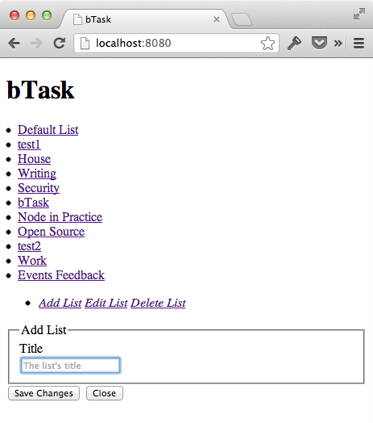

================
Создание списков
================

Подготовка
==========

Перед началом этого урока, Вам понадобится cледующее:

  * `alexyoung/dailyjs-backbone-tutorial <https://github.com/alexyoung/dailyjs-backbone-tutorial>`_
    коммит ``82fe08e``
  * API key из :ref:`части 2 <google-api-key-setup>`
  * Client ID из :ref:`части 2 <google-client-id-setup>`
  * обновить ``app/js/config.js`` полученными значениями (если Вы зачекаутили мой репо)

Чтобы получить исходный код, выполните следующую команду (или используйте
подходящую Git UI утилиту):

.. code-block:: bash

    $ git clone git@github.com:alexyoung/dailyjs-backbone-tutorial.git
    $ cd dailyjs-backbone-tutorial
    $ git reset --hard 82fe08e

CRUD для списков
================

Последние несколько частей данной серии уроков показали, как работать
с Google Task API и аутентиифцировать пользователей с помощью OAuth. На
данный момент Вы должны иметь возможность выполнять вход и просматривать
списки списков задач.

Как мы уже видели, Backbone.js построен на базе RESTful API, которое
работает в трминах CRUD (create, read, update and delete). В части #4,
:doc:`backbone-tutorial-4`, я объяснял, как реализовать свою версию
метода ``Backbone.sync``, которая умеет работать с Google API. Но пока
мы реализовали только функцию чтения, в которой списки задач получаются
с помощью ``gapi.client.tasks``.

Теперь пришла пора реализовать все CRUD операции, чтобы пользователи могли
полноценно работать со списками. В 4-ой части было показано, как Google API
сопоставляются с ``sync`` операциями в Backbone:

================    ===================     =============================
Google Tasks API    Backbone.sync метод     Описание
================    ===================     =============================
``insert``          ``create``              Создание новой задачи
``update``          ``update``              Изменение сущестующей задачи
``delete``          ``delete``              Удаление задачи
``list``            ``read``                Получение списка задач
================    ===================     =============================

В этой части мы добавим функцию ``create``. Но, как Вы увидите, основной
принцип будет практически такой же, как и в реализации метода ``read``.

Создание списков
================

Для создания списков нам понадобятся несколько новых компонентов:

  #. подходящие кнопки
  #. шаблон формы
  #. представления добавления и редактирования
  #. код функции контроллёра

Модели и коллекции в Backbone умеют генерировать события. У нас уже есть код,
управляющий представлением элемента списка. Так что, нам достаточно лишь
добавить код, который будет срабатывать при получении события, когда создана
новая модель и добавлена в коллекцию ``TaskLists``.

Управление и использование событий таким образом — это основной подход к
созданию поддерживаемого Backbone.js кода.

Backbone.sync
=============

Пока ``Backbone.sync`` умеет лишь читать списки из Google API. Чтобы добавить
возможность создавать списки, нам потребуется добавить немного кода. То, что
мы сейчас сделаем, будет сильно похоже на уже пройденный материал, так что
я буду делать это быстро.

Вернёмся в ``app/js/gapi.js`` и добавим вызов ``gapiRequest`` при выполнении
``create`` метода в ``Backbone.sync``:

.. code-block:: javascript

    Backbone.sync = function(method, model, options) {
      var requestContent = {};
      options || (options = {});

      switch (method) {
        case 'create':
          requestContent['resource'] = model.toJSON();
          request = gapi.client.tasks[model.url].insert(requestContent);
          Backbone.gapiRequest(request, method, model, options);
        break;

Выглядит очень похоже на код, который был в реализации метода ``read``.
Осталась ещё одна вещь, которую надо сделать в этом файле: научить
``Backbone.gapiRequest`` работать с одиночными ресурсами. Так как код
метода небольшой, я покажу его тут целиком:

.. code-block:: javascript

    Backbone.gapiRequest = function(request, method, model, options) {
      var result;
      request.execute(function(res) {
        if (res.error) {
          if (options.error) options.error(res);
        } else if (options.success) {
          if (res.items) {
            result = res.items;
          } else {
            result = res;
          }
          options.success(result, true, request);
        }
      });
    };

Теперь метод проверяет, что вернулось из Google API: массив элементов или
просто один объект. Тут так же есть один очень важный момент: ``Backbone.sync``
является прослойкой между множеством другого Backbone кода. Так же этот
метод способен предоставлять Backbone свойства, которые будут использованы
при установке свойств моделей. Может показаться, что код ``gapiRequest`` не
делает сильно много работы. Однако обратите внимание, что функция обратного
вызова ``success`` получит ``result``, в котором при создании модели будет
свойство ``id``.  Backbone, увидев это свойство, автоматически установит его
значение для свойства ``id`` у нашей модели!

Шаблоны
=======

Откройте ``app/js/templates/app.html`` и скорректируйте слой
``div signed-in-container``, чтобы он теперь содержал список и ещё один слой
контейнера:

.. code-block:: html

    <ul class="nav nav-tabs" id="top-nav">
      <li class="buttons">
        

          <a href="#" class="btn" id="add-list-button">
                <i class="icon-plus">Add List</i></a>
          <a href="#" class="btn" id="edit-list-button">
                <i class="icon-cog">Edit List</i></a>
          <a href="#" class="btn delete-list" id="delete-list-button">
                <i class="icon-trash">Delete List</i></a>
        

      </li>
    </ul>
    

      

      

    

Ближе к концу данной статьи Вы сможете воспользоваться кнопкой «Add List».

Теперь откройте ``app/js/templates/lists/form.html`` и добавьте:

.. code-block:: html

    <fieldset>
      <legend>
        Edit List
        <a href="#" class="pull-right delete-list btn">
            <i class="icon-trash"></i></a>
      </legend>
      

        <label class="control-label" for="list_title">Title</label>
        

          <input type="text" class="input-xlarge" name="title"
                 id="list_title" value="{{title}}"
                 placeholder="The list's title">
        

      

    </fieldset>
    

      <button type="submit" class="btn btn-primary">Save Changes</button>
      <button class="cancel btn">Close</button>
    

Это тело формы, которая будет использована при добавлении или редактировании
списков.

Представления создания и редактирования
=======================================

Сейчас я собираюсь описать лишь функцию добавления списков. Остальную часть
функций мы рассмотрим позже. Итак, какая же разница между представлением
добавления и редактирования? Шаблон ``form.html`` может быть использован в
обоих случаях. Тогда почему мы просто не сделаем представление редактирования
и не унаследуемся от него для создания представления добавления нового списка?

Окройте ``app/js/views/lists/edit.js`` и добавьте следующее новое представление:

.. code-block:: javascript

    define(['text!templates/lists/form.html'], function(template) {
      var EditListView = Backbone.View.extend({
        tagName: 'form',
        className: 'form-horizontal well edit-list',
        template: _.template(template),

        events: {
          'submit': 'submit'
        , 'click .cancel': 'cancel'
        },

        initialize: function() {
          this.model.on('change', this.render, this);
        },

        render: function() {
          var $el = $(this.el);
          $el.html(this.template(this.model.toJSON()));

          if (!this.model.get('id')) {
            this.$el.find('legend').html('Add List');
          }

          return this;
        },

        submit: function() {
          var self = this
            , title = this.$el.find('input[name="title"]').val()
            ;

          this.model.save({ title: title }, {
            success: function() {
              self.remove();
            }
          });

          return false;
        },

        cancel: function() {
          this.$el.hide();
          return false;
        }
      });

      return EditListView;
    });

В данном классе я объявил события для подтверждения и закрытия формы и
связал их с соответствующими методами. Так же, я связал событие ``change``
модели с методом ``render``, так что изменения в модели будут автоматически
отрисовываться. Этот момент будет важен чуть позже.

Обратите внимание, что в методе ``render`` элемент ``legend`` будет изменён,
если у модели ещё нет свойства ``id``. Другими словами, если модель ещё не
сохранена, то показываем другой заголовок и прячем кнопку удаления.

А теперь сравните этот файл с ``app/js/views/lists/add.js``:

.. code-block:: javascript

    define([
      'models/tasklist'
    , 'views/lists/edit'
    ],

    function(TaskList, EditListView) {
    var AddListView = EditListView.extend({
      submit: function() {
        var self = this
          , title = this.$el.find('input[name="title"]').val()
          ;

        this.model.save({ title: title }, { success: function(model) {
          // Add the updated model to the collection
          bTask.collections.lists.add(model);
          self.remove();
        }});

        return false;
      }
    });

    return AddListView;
    });

В этом файле для загрузки ``EditListView`` используется ``RequireJS``, после
чего происходит наследование от него. Далее, переопределяется метод ``submit``,
так как создание списка немного отличается от его изменения. После того, как
список создан, обновлённая модель получается с сервера в функции обратного
вызова ``success``. После этого модель добавляется в глобальную коллекцию
``lists``. В завершении всего, представление удаляет само себя.

.. _add-list-button:

Кнопка добавления списка
========================

Ссылка для создания списков была добавлена в главный шаблон ``app.html``
ранее.  Чтобы начать обрабатывать её, откройте ``app/js/views/app.js`` и
добавьте новый метод ``addList``:

.. code-block:: javascript

    addList: function() {
      var list = new bTask.collections.lists.model({ title: '' })
        , form = new AddListView({ model: list })
        , self = this
        ;

      this.$el.find('#list-editor').html(form.render().el);
      form.$el.find('input:first').focus();

      return false;
    }

Этот код отрисует шаблон ``AddListView`` и установит фокус на поле заголовка.
Чтобы загрузить представление ``AddListView``, необходимо скорректировать
заголовок файла:

.. code-block:: javascript

    define([
      'text!templates/app.html'
    , 'views/lists/add'
    ],

    function(template, AddListView) {

И, наконец, добавьте объявление обработчиков событий где-нибудь в ``AppView``:

.. code-block:: javascript

    events: {
      'click #add-list-button': 'addList'
    },

Фиксим баг
==========

В :ref:`прошлый раз <listmenuview>` был «посажен» баг, который преумножает
количество списков при их отрисовке. Чтобы его исправить, необходимо в файле
``app/js/views/lists/menu.js`` добавить метод отрисовки каждого элемента меню,
а так же скорректировать метод инициализации:

.. code-block:: javascript

    initialize: function() {
      this.collection.on('add', this.renderMenuItem, this);
    },

    renderMenuItem: function(model) {
      var item = new ListMenuItemView({ model: model });
      this.$el.append(item.render().el);
    },

И последний шаг — использовать новый метод ``renderMenuItem`` в методе
``render`` при обходе каждого элемента коллекции:

.. code-block:: javascript

    render: function() {
      var $el = $(this.el)
        , self = this;

      this.collection.each(function(list) {
        self.renderMenuItem(list);
      });

      return this;
    }

Итоги
=====

Теперь Вы можете добавлять списки, если выполните в консоле ``node server`` и
откроете в браузере ``http://localhost:8080``. Пока наш проект не выглядит
круто, но я это скоро исправлю.

Все изменения — `одной пачкой <https://github.com/alexyoung/dailyjs-backbone-tutorial/tree/465523fa20c9f17a422de3646a8db5f7d1b707e8>`_.
