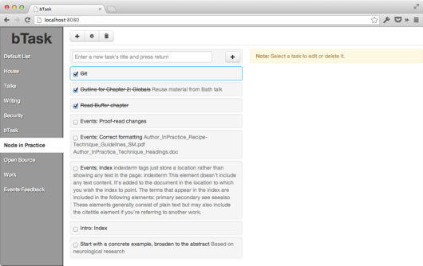

======
Задачи
======

Подготовка
==========

Перед началом этого урока, Вам понадобится cледующее:

  * `alexyoung/dailyjs-backbone-tutorial <https://github.com/alexyoung/dailyjs-backbone-tutorial>`_
    коммит ``8d88095``
  * API key из :ref:`части 2 <google-api-key-setup>`
  * Client ID из :ref:`части 2 <google-client-id-setup>`
  * обновить ``app/js/config.js`` полученными значениями (если Вы зачекаутили мой репо)

Чтобы получить исходный код, выполните следующую команду (или используйте
подходящую Git UI утилиту):

.. code-block:: bash

    $ git clone git@github.com:alexyoung/dailyjs-backbone-tutorial.git
    $ cd dailyjs-backbone-tutorial
    $ git reset --hard 8d88095

CRUD для задач
==============

В этой части будет рассмотрено следующее:

  * создание представления для задачи
  * создание представления для списка задач
  * добавление коллекции задач
  * получение задач из Google API

Действительно интересная часть, которую Вам захочется вспомнить — это
взаимодействие между родительским представлением и его «детьми». Backbone
никак не позволяет указывать связь между моделями или коллекциями. В нашем
примере, в идеале, хотелось бы иметь возможность просто сказать: «задачи
принадлежат спискам» или «представления задачи принадлежат представлениям
списков». Однако, де факто, такой возможности указания взаимосвязи нет. Есть
сторонние библиотеки, позволяющие сделать это. Но я покажу, как сделать это
на чистом Backbone/Underscore.

Подготовка
==========

Перед началом, создадим несколько директорий:

.. code-block:: bash

    $ mkdir app/js/views/tasks
    $ mkdir app/js/templates/tasks

А так же добавим новую коллекцию в ``app/js/collections/tasks.js``:

.. code-block:: javascript

    define(['models/task'], function(Task) {
      var Tasks = Backbone.Collection.extend({
        model: Task,
        url: 'tasks'
      });

      return Tasks;
    });

Коллекция ``Tasks`` пока ничего не делает из того, что мы уже видели ранее.
Получение задач из Google’s API требует наличия ``tasklist``, так что,
необходимо добавить дополнительный параметр в метод ``fetch``:

.. code-block:: javascript

    collection.fetch({ data: { tasklist: this.model.get('id') }, // ...

Это похоже на прошлый аналогичный вызов для получения ``TaskLists``, когда мы
передавали ``{ userId: '@me' }``. Так что, кажется, что в контексте данного
приложения такой вызов выглядит вполне согласовано.

Шаблон, содержащий представление задач, так же включает в себя форму для
создания новых задач, контейнер для списка задач и ещё один контейнер для
текущей (выбранной) задачи (чтобы ёё можно было редактировать). Этот файл
необходимо сохранить как ``app/js/templates/tasks/index.html``:

.. code-block:: html

    

      

        <form class="well row form-inline add-task">
          <input type="text" class="pull-left"
                 placeholder="Enter a new task's title and press return"
                 name="title">
          <button type="submit" class="pull-right btn">
            <i class="icon-plus"></i>
          </button>
        </form>
      

      <ul id="task-list"></ul>
    

    

      

      

        <strong>Note:</strong> Select a task to edit or delete it.
      

    

Тут используется несколько css-классов из `Bootstrap <http://twitter.github.com/bootstrap/>`_
для создания колонок. Далее, создаём файл ``app/js/templates/tasks/task.html``
и добавляем следующие элементы для отображения ``TaskView``: заголовок,
примечание и чекбокс, для переключения сосотояния задачи:

.. code-block:: html

    <input type="checkbox" data-task-id="{{id}}" name="task_check_{{id}}"
          class="check-task" value="t">
    {{title}}
    {{notes}}

Представления
=============

Представление ``TasksIndexView`` загружает задачи с помощью коллекции ``Tasks``,
после чего отрисовывает полученные данные с помощью ``TaskView``. Вот как должен
выглядеть ``TasksIndexView`` из файла ``app/js/views/tasks/index.js``:

.. code-block:: javascript

    define([
        'text!templates/tasks/index.html',
        'views/tasks/task',
        'collections/tasks'
      ],
      function(template, TaskView, Tasks) {
        var TasksIndexView = Backbone.View.extend({
          tagName: 'div',
          className: 'row-fluid',

          template: _.template(template),

          events: {
            'submit .add-task': 'addTask'
          },

          initialize: function() {
            this.children = [];
          },

          addTask: function() {
          },

          render: function() {
            this.$el.html(this.template());

            var $el = this.$el.find('#task-list')
              , self = this;

            this.collection = new Tasks();
            this.collection.fetch({
              data: { tasklist: this.model.get('id') },
              success: function() {
                self.collection.each(function(task) {
                  var item = new TaskView({ model: task, parentView: self });
                  $el.append(item.render().el);
                  self.children.push(item);
                });
            }});

            return this;
          }
        });

        return TasksIndexView;
    });

В данном примере задачи загружаются с помощью ``collection.fetch``, после чего
для каждой из полученных задач создаётся экземпля ``TaskView``. Вот реализация ``TaskView``
(``app/js/views/tasks/task.js``):

.. code-block:: javascript

    define(['text!templates/tasks/task.html'], function(template) {
      var TaskView = Backbone.View.extend({
        tagName: 'li',
        className: 'controls well task row',

        template: _.template(template),

        events: {
          'click': 'open'
        },

        initialize: function(options) {
          this.parentView = options.parentView;
        },

        render: function(e) {
          var $el = $(this.el);
          $el.data('taskId', this.model.get('id'));
          $el.html(this.template(this.model.toJSON()));
          $el.find('.check-task').attr('checked',
                        this.model.get('status') === 'completed');

          return this;
        },

        open: function(e) {
          if (this.parentView.activeTaskView) {
            this.parentView.activeTaskView.close();
          }
          this.$el.addClass('active');
          this.parentView.activeTaskView = this;
        },

        close: function(e) {
          this.$el.removeClass('active');
        }
      });

      return TaskView;
    });

Метод ``open`` в состоянии определить, был ли клик на другой задаче, так
как отслеживается родительское представление. Если был, то ранее активированная
задача деактивируется (удаляется класс ``active``). Существует несколько
вариантов реализации данной задачи: я видел, как люди проходят по всем
представлениям и закрывают их, используя ``$('selector').removeClass('active')``,
чтобы удалить все связанные с ``active`` классом элементы или через вызов
триггера в модели. Мне кажется, что код, связанный с представлениями, должен
находиться  в представлениях. А модели  и коллекции должны выполнять их
собственные задачи.

Далее, добавим ``TasksIndexView`` в ``define`` в файл
``app/js/views/lists/menuitem.js``:

.. code-block:: javascript

    define([
        'text!templates/lists/menuitem.html'
      , 'views/tasks/index'
      ],
      function(template, TasksIndexView)
        // ...

А так же скорректируем метод ``open``, чтобы в нём создвался экземпляр
``TasksIndexView``:

.. code-block:: javascript

    open: function() {
      if (bTask.views.activeListMenuItem) {
        bTask.views.activeListMenuItem.$el.removeClass('active');
      }

      bTask.views.activeListMenuItem = this;
      this.$el.addClass('active');

      // Render the tasks
      if (bTask.views.tasksIndexView) {
        bTask.views.tasksIndexView.remove();
      }

      bTask.views.tasksIndexView = new TasksIndexView({
        collection: bTask.collections.tasks,
        model: this.model
      });
      bTask.views.app.$el.find('#tasks-container').html(
            bTask.views.tasksIndexView.render().el);

      return false;
    }

Тут отслеживается последний созданный экземпляр ``TasksIndexView``, так что
он может быть удалён вручную. Вызов метода ``remove`` — это, обычно, хорошая
мысль, так как события будут отвязаны перед тем, как представление выдет за
пределы области видимости (позже я напишу руководство по Backbone и сборщику
мусора).

Так же я добавил несколько значений по-умолчанию в модель ``Task`` в файл
(``app/js/models/task.js``):

.. code-block:: javascript

    define(function() {
      var Task = Backbone.Model.extend({
        url: 'tasks',
        defaults: { title: '', notes: '' }
      });

      return Task;
    });

Это сделано для того, чтобы в ``TaskView`` не было ошибок для задач, у
которых нет заголовка или примечания (для задач из Google Tasks нормальная
ситуация, когда нет, например, примечания).

С учётом всех этих изменений в шаблонах и представлениях, теперь Вы можете
выбирать список и просматривать или выбирать в них задачи.

Стили
=====

Приложение, в его нынешнем виде, не сильно проработано в визуальном смысле.
Поэтому, я добавил Bootstrap. Необходимо лишь скачать несколько CSS файлов
и картинок. И положить их в ``app/css`` и ``app/img``:

.. code-block:: bash

    $ wget http://twitter.github.io/bootstrap/assets/bootstrap.zip
    $ unzip bootstrap.zip
    $ cp bootstrap/css/bootstrap.min.css app/css/
    $ mkdir app/img
    $ cp bootstrap/img/* app/img/

А так же добавить вызов ``css/bootstrap.min.css`` в ``app/index.html``:

.. code-block:: html

    <!DOCTYPE html>
    <head>
      <meta charset="utf-8">
      <title>bTask</title>
      
      
      <link rel="stylesheet" href="css/bootstrap.min.css">
      <link rel="stylesheet" href="css/app.css">
    </head>
    <body>
      
    </body>
    </html>

Так же я добавил немного своих стилей, чтобы получить расположение элементов,
основанное на панелях, показывающие наши задачи схожим с `Things`_ образом.
Таким образом, так будет выглядеть ``app/css/app.css``:

.. code-block:: css

    #main { padding-left: 0; height: 100% }
    #sign-in-container, #signed-in-container { display: none }
    h1 { margin: 0 0 10px 0; padding: 0; text-align: center }

    .main-left-col {
        height: 100%;
        position: fixed;
        padding-top: 10px;
        box-shadow: inset -1px 0 3px #000;
        overflow: auto;
        background-color: #999}

    .left-nav {
        list-style-type: none;
        margin: 0;
        padding: 0 }
    .left-nav li a {
        display: block;
        text-shadow: 1px 1px #000;
        color: #fff;
        padding: 10px;
        width: 100% }
    .left-nav li.active a {
        background-color: #fff;
        color: #333;
        text-shadow: none;
        font-weight: bold }
    .left-nav li a:hover {
        text-decoration: none;
        background-color: #fff;
        color: #333;
        text-shadow: none;
        font-weight: bold }

    .main-right-col { margin-left: 16.5%; margin-top: 10px }

    #top-nav { margin-bottom: 10px; padding-bottom: 10px }
    #list-editor { display: none; }

    #add-task form, .task { padding: 5px; margin: 0 0 5px 0 }
    #add-task input[name="title"] { width: 80% }

    #task-list { margin: 0; padding: 0; list-style-type: none }
    .task { vertical-align: middle }
    .task { padding: 8px; margin: 0 0 5px 0; }
    .task.active { border: 1px solid #049cdb }
    .task .notes { color: #888 }
    .task input { margin-right: 3px }

    .completed { text-decoration: line-through; }

.. _`Things`: http://culturedcode.com/things/

И, наконец, немного корректировок ``app/js/templates/app.html``:

.. code-block:: html

    

      

        <h1>bTask</h1>
        <ul class="left-nav"></ul>
      

      

        <small class="pull-right" id="profile-container"></small>
        

          

          

            <ul class="nav nav-tabs" id="top-nav">
              <li class="buttons">
                

                  <a href="#" class="btn" id="add-list-button">
                    <i class="icon-plus"></i></a>
                  <a href="#" class="btn" id="edit-list-button">
                    <i class="icon-cog"></i></a>
                  <a href="#" class="btn delete-list" id="delete-list-button">
                    <i class="icon-trash"></i></a>
                

              </li>
            </ul>
            

              

              

            

          

        

      

    

Backbone 0.9.10
===============

Я обновил Backbone до версии 0.9.10 и добавил её в репоиторий. Мне пришлось
изменить ``Backbone.sync``: теперь при вызове метода ``options.success``
передаются немного другие параметры в ``app/js/gapi.js``:

.. code-block:: javascript

    options.success(model, result, request);

.. note::

    В моём случае, после выполнения данной замены всё сломалось: перестали
    грузиться списки с сервера и стала вылезать ошибка:

        ``Uncaught ReferenceError: id is not defined``

    Вылезала она из ``menuitem.js``, строчка:

        ``$el.html(this.template(this.model.toJSON()));``

    Так что, я безболезненно оставил прежний способ вызова функции обратного
    вызова ``success``. Проверял с ``Backbone 1.0.0``.

Итоги
=====

Все изменения — `одной пачкой <https://github.com/alexyoung/dailyjs-backbone-tutorial/commit/0491ad6e7de28ccfe0cab59138a93c469a3f2a7e>`_.
