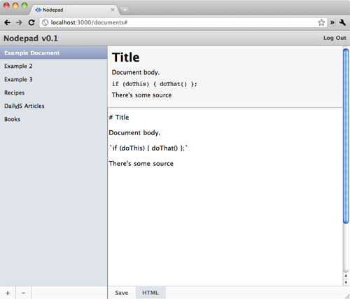

========
Markdown
========

Добро пожаловать в десятую часть руководства по созданию веб-приложения
с помощью **Node.js**. В рамках серии уроков будет рассказано про основные
особенности и трудности, которые возникают при работе с Node.js.

Предыдущие части:

- :doc:`node-tutorial-1`
- :doc:`node-tutorial-2`, коммит: 4ea936b_
- :doc:`node-tutorial-3`, коммит: 39e66cb_
- :doc:`node-tutorial-4`, коммит: f66fdb5_
- :doc:`node-tutorial-5`, коммит: 03fe9b2_
- :doc:`node-tutorial-6`, коммит: f2261c5_
- :doc:`node-tutorial-7`, коммит: 929f564_
- :doc:`node-tutorial-8`, коммит: df0b954_
- :doc:`node-tutorial-9`, коммит: 1904c6b_

.. _4ea936b: https://github.com/alexyoung/nodepad/tree/4ea936b4b426012528fc722c7576391b48d5a0b7
.. _39e66cb: https://github.com/alexyoung/nodepad/tree/39e66cb9d11a67044495beb0de1934ac4d9c4786
.. _f66fdb5: https://github.com/alexyoung/nodepad/tree/f66fdb5c3bebdf693f62884ffc06a40b93328bb5
.. _03fe9b2: https://github.com/alexyoung/nodepad/tree/03fe9b272fea1beb98ffefcf5f7ed226c81c49fd
.. _f2261c5: https://github.com/alexyoung/nodepad/tree/f2261c510c987b35df1e6e000be6e1e591cd9d6d
.. _929f564: https://github.com/alexyoung/nodepad/tree/929f5642ca1b2fa664df517457e056c92490d892
.. _df0b954: https://github.com/alexyoung/nodepad/tree/df0b954b3c4e83a69ab4cfe2d87f2fb1d0ffa162
.. _1904c6b: https://github.com/alexyoung/nodepad/tree/1904c6b7f95d708474a5d42e8cdfd40e96243a7a

Поддержка Markdown
==================

Было бы здорово, если бы наша записная книжка поддерживала бы какой-нибудь
вид разметки. В npm_ есть несколько markdown-библиотек, самой популярной
из которых является markdown_.

.. _npm: 
.. _markdown: https://github.com/evilstreak/markdown-js

Чтобы её установить, необходимо выполнить следующее::

    npm install markdown

Библиотека достаточно легка в использовании:

.. code-block:: javascript

    var markdown = require('markdown').markdown;
    markdown.toHTML('# Welcome\n\nThis is markdown');

    // => '<h1>Welcome</h1>\n\n
This is markdown
'

Подключение Markdown
--------------------

Я обновил зависимости для Nodepad'a, включив в файл ``package.json``
запись о markdown:

.. code-block:: javascript

    // ...
    "dependencies": {
      "express": "1.0.0",
      "mongoose": "0.0.4",
      "connect-mongodb": "0.1.1",
      "jade": "0.6.0",
      "markdown": "0.2.0"
    }

В начале файла ``app.js`` я добавил ``require``:

.. code-block:: javascript

    var express = require('express@1.0.0'),
        app = module.exports = express.createServer(),
        mongoose = require('mongoose@0.0.4').Mongoose,
        mongoStore = require('connect-mongodb@0.1.1'),
        markdown = require('markdown').markdown,
    // ...

Документы в HTML формате
------------------------

Я так же добавил поддержку формата ``html`` в обработчик запросов вида
``/documents/:id.:format?``, сутью которого является преобразование
markdown в html:

.. code-block:: javascript

    // Считать документ
    app.get('/documents/:id.:format?', loadUser, function(req, res, next) {
      Document.findById(req.params.id, function(d) {
        if (!d) return next(new NotFound('Document not found'));

        switch (req.params.format) {
          case 'json':
            res.send(d.__doc);
          break;

          case 'html':
            res.send(markdown.toHTML(d.data));
          break;

          default:
            res.render('documents/show.jade', {
              locals: { d: d, currentUser: req.currentUser }
            });
        }
      });
    });

Теперь при обращении к документу с конкретным ID и с окончанием «.html»
вернется HTML, сгенерированный с помощью makrdown. Сделать это достаточно
легко, использую вызов ``$.get``.

Просмотр Markdown
-----------------

Рядом с кнопкой «Save» (``#html-button``) я добавил еще одну ссылку (кнопку),
которая показывает текущий markdown текст в HTML виде в отдельном слое:

.. code-block:: javascript

    $('#html-button').click(function() {
      var container = $('#html-container');

      if (container.is(':visible')) {
        container.html('').hide();
        $('#html-button').removeClass('active');

      } else {
        $('#save-button').click();
        $('#html-button').addClass('active');

        var id = $('#document-list .selected').itemID();
        $.get('/documents/' + id + '.html', function(data) {
          // Данные сохранены, вернется JSON
          container.html(data).show();
        });
      }
    });

Чтобы определить, виден ли слой, показывающий преобразованный из markdown
в HTML текст, используется функция ``jQuery.is()``. Если слой не виден, то
при нажатии на кнопку, этой кнопке добавляется класс, обозначающий, что
слой виден. Выглядит это следующим образом:

Кнопка «Удалить»
================

Макет приложения несколько изменился с тех пор, как началась данная серия
уроков, так что я доработал код удаления документа, чтобы он корректно работал
с новым расположением элементов. Используется всё тот же jQuery с новым URL
для ``$.post``.

Заключение
==========

Поддержка таких разметок, как markdown или textile, в **Node.js**
приложениях — достаточно простая задача, так как в npm есть все
необходимые модули.

Последний коммит для текущей части — 11d33e1_.

.. _11d33e1: https://github.com/alexyoung/nodepad/tree/11d33e19066e76c8559857fb780ac9fd1ecf68ac
