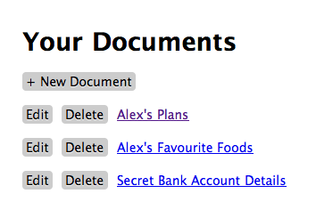

=============================================
Jade шаблоны, создание и изменение документов
=============================================

Добро пожаловать в четвертую часть руководства по созданию веб-приложения
с помощью **Node.js**. В рамках серии уроков будет рассказано про основные
особенности и трудности, которые возникают при работе с Node.js.

Предыдущие части:

- :doc:`node-tutorial-1`
- :doc:`node-tutorial-2`, коммит: `4ea936b`_
- :doc:`node-tutorial-3`, коммит: `39e66cb`_

.. _4ea936b: https://github.com/alexyoung/nodepad/tree/4ea936b4b426012528fc722c7576391b48d5a0b7
.. _39e66cb: https://github.com/alexyoung/nodepad/tree/39e66cb9d11a67044495beb0de1934ac4d9c4786

В этой части я добавлю столько кода, что Вам лучше для начала пойти и
сделать себе чашечку чая.

В конце этой части у Вас будет что—то похожее на это:

В тексте руководства будет не весь исходный код: я сократил несколько
примеров и не включил CSS. Но все они доступны в git репозитории, так
что смело качайте и открывайте в своем редакторе.

Отрисовка шаблонов
==================

Метод вывода списка документов (``/documents``) должен выводить на экран
документы, которые мы можем редактировать. Для этого необходимо добавить
соответствующий вызов ``render``:

.. code-block:: javascript

    res.render('documents/index.jade', {
      locals: { documents: documents }
    });

а в соответствующем шаблоне необходимо добавить::

    ul
      - for (var d in documents)
        li= d.title

Напоминаю, что наши шаблоны написаны на языке Jade_ - шаблонного движка
по-умолчанию в Express.

.. _Jade: http://jade-lang.com/

Шаблонный движок Jade
=====================

Сначала синтаксис Jade кажется немного странным, но спустя некоторое
время становится понятно что к чему. Вот основные моменты:

- вложенность тэгов формируется отступами
- знак равенства означает: вставить содержимое переменной
- знак "не равно" означает: вставить содержимое переменной без экранирования
- дефис позволяет добавлять JavaScript

Обратите внимание, рекомендуется экранировать как можно больше содержимого,
дабы минимизировать возможность появления XSS атак.

Врезки (Partials)
=================

Jade и Express позволяют легко использовать врезки - небольшие фрагменты
повторно используемого шаблона. Ниже представлен шаблон для создания
документа (``views/documents/new.jade``):

.. code-block:: javascript

    h2 New Document
    form(method='post', action='/documents')
      !=partial('documents/fields', { locals: { d: d } })

Врезки отрисовываются с помощью вызова ``partial(template-file-name, options)``.
Результат не экранируется (иначе бы мы видели сами тэги), а пользовательские
поля, наоборот, экранируются, так что тут беспокоиться не о чем.

Формы создания и редактирования
===============================

Перед тем, как начать писать потрясающий Ajax'овых интерфейс, давайте
подготовим несколько простых шаблонов. В нашем REST API определены методы
создания и изменения. Соответственно, нам необходимо предоставить такие
же возможности в пользовательском интерфейсе.

Обычно, подобные формы я разбиваю на три шаблона. Одну врезку, в которой
содержатся поля формы. И еще два шаблона: для создания и изменения. Последние
содержат необходимый код формы, в который импортируется врезка с полями.

Форма создания документа была приведена в примере выше. Форма редактирования
(``views/documents/edit.jade``) выглядит так:

.. code-block:: javascript

    h2 Edit Document
    form(method='post', action='/documents/' + d.id)
      input(name='document[id]', value=d.id, type='hidden')
      input(name='_method', value='PUT', type='hidden')
      !=partial('documents/fields', { locals: { d: d } })

Код практически идентичен форме создания документа. Исключение составляют
скрытые поля. Поле ``_method`` позволяет постить форму в виде HTTP-метода
``PUT``.

Код врезки (``views/partials/documents/fields.jade``) так же достаточно
прост:

.. code-block:: javascript

    div
      label Title:
        input(name='document[title]', value=d.title || '')
    div
      label Note:
        textarea(name='document[data]')
          =d.data || ''
    div
      input(type='submit', value='Save')

К этому моменту Вы должны уже прочувствовать суть Jade. Я не являюсь фанатом
Jade, но как Вы, наверное, заметили, в этих примерах синтаксис очень доступный.

Серверные методы создания и редактирования
==========================================

Всё, что делают методы создания и редактирования на серверной стороне - это
загружают документ и отрисовывают форму:

.. code-block:: javascript

    app.get('/documents/:id.:format?/edit', function(req, res) {
      Document.findById(req.params.id, function(d) {
        res.render('documents/edit.jade', {
          locals: { d: d }
        });
      });
    });

    app.get('/documents/new', function(req, res) {
      res.render('documents/new.jade', {
        locals: { d: new Document() }
      });
    });

Метод создания документа генерирует пустой ``Document``, чтобы форма в шаблоне
была счастлива.

Идентифкаторы в Mongo
=====================

Вы заметили, что шаблоны ссылаются на ``d.id``? Mongoose создает поля ``_id``
по-умолчанию, которые имеют тип ``ObjectID``. Последний факт выглядит не очень
здорово, поэтому я написал специальный геттер и добавил его в ``model.js``:

.. code-block:: javascript

    getters: {
      id: function() {
        return this._id.toHexString();
      }
    }

С помощью ``toHexString`` мы получаем элегантные ID, наподобие
``4cd733fb20a558cee5000001``.

Обновление и удаление
=====================

Каждый из методов сначала находит необходимый документ, после чего вызывает,
либо ``save``, либо ``remove`` для найденного документа. Например, метод
обновления выглядит так:

.. code-block:: javascript

    app.put('/documents/:id.:format?', function(req, res) {
      // Находим документ
      Document.findById(req.body.document.id, function(d) {
        // Делаем что-то с ним
        d.title = req.body.document.title;
        d.data = req.body.document.data;

        // Сохраняем изменения
        d.save(function() {
          // Выдаем результат в запрошенном формате
          switch (req.params.format) {
            case 'json':
              res.send(d.__doc);
             break;

             default:
              res.redirect('/documents');
          }
        });
      });
    });

Метод удаления практически такой же. Исключение составялет лишь вызов
``remove`` вместо ``save``.

Удаление в JavaScript
=====================

В нашем API есть одна странность: в Express мы используем метод ``del``,
что означает, что Express ожидает увидеть ``_method="delete"`` в параметрах
POST запроса. Большинство фреймворков реализуют эту возможность с помощью
небольшого количества клиентского JavaScript'a.

Как я уже говорил в первой части, мы будем использовать jQuery. Включить
его в наш шаблон ``layout.jade`` можно так:

.. code-block:: javascript

    !!!
    html
      head
        title= 'Nodepad'
        link(rel='stylesheet', href='/stylesheets/style.css')
        script(type='text/javascript',
          src='https://ajax.googleapis.com/ajax/libs/jquery/1.4.4/jquery.min.js')
      body!= body
        script(type='text/javascript', src='/javascripts/application.js')

В конце шаблона так же включается наш JavaScript код. Express уже настроен
и готов отдавать статические файлы, которые находятся в директории ``public``.

Клиентский delete на JavaScript'е работает следующим образом:

- с помощью ``confirm()`` убеждается, что пользователь действительно хочет
  удалить документ
- на лету вставляет форму со скрытым полем ``_method`` и значением ``delete``
- подтверждает форму и отправляет POST на сервер

Всё это легко делается с помощью jQuery. Я реализовал эту логику в виде
одной цепочки команд:

.. code-block:: javascript

    $('.destroy').live('click', function(e) {
      e.preventDefault();
      if (confirm('Are you sure you want to delete that item?')) {
        var element = $(this),
            form = $('<form></form>');
        form
          .attr({
            method: 'POST',
            action: element.attr('href')
          })
          .hide()
          .append('<input type="hidden" />')
          .find('input')
          .attr({
            'name': '_method',
            'value': 'delete'
          })
          .end()
          .submit();
      }
    });

В примере используется делегирование с помощью ``live``, так что нам не
придется засорять HTML встроенным JavaScript'ом.

Главная страница
================

Я сделал действием по-умолчанию перенаправление на ``/documents``. Страница
со списком документов выглядит так:

.. code-block:: javascript

    h1 Your Documents

    p
      a(class='button', href='/documents/new') + New Document

    ul
      - for (var d in documents)
        li
          a(class='button', href='/documents/' + documents[d].id + '/edit') Edit
          a(class='button destroy', href='/documents/' + documents[d].id) Delete
          a(href='/documents/' + documents[d].id)
            =documents[d].title

Это пример использования итератора в Jade. Лучше бы было, конечно, использовать
врезки, но в данном случае преследовалась цель продемонстрировать работу блоков
управления в шаблонах Jade.

Заключение
==========

После серии коммитов de51d04_, 50ec367_, f66fdb5_ мы, наконец, имеем рабочее
приложение.

.. _de51d04 : https://github.com/alexyoung/nodepad/commit/de51d040ae7255c661bed4e3b36010cac2d879a1
.. _50ec367 : https://github.com/alexyoung/nodepad/commit/50ec3676a6b1a1bc21516ec2ce1ea72843778a9b
.. _f66fdb5 : https://github.com/alexyoung/nodepad/commit/f66fdb5c3bebdf693f62884ffc06a40b93328bb5
