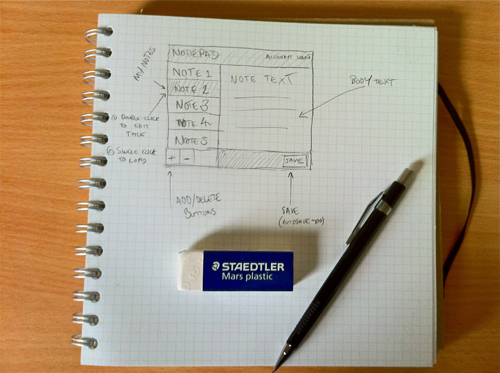
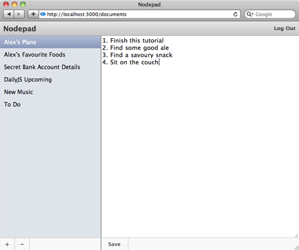

=====================================
Базовый интерфейс с помощью jQuery UI
=====================================

Добро пожаловать в шестую часть руководства по созданию веб-приложения
с помощью **Node.js**. В рамках серии уроков будет рассказано про основные
особенности и трудности, которые возникают при работе с Node.js.

Предыдущие части:

- :doc:`node-tutorial-1`
- :doc:`node-tutorial-2`, коммит: `4ea936b`_
- :doc:`node-tutorial-3`, коммит: `39e66cb`_
- :doc:`node-tutorial-4`, коммит: `f66fdb5`_
- :doc:`node-tutorial-5`, коммит: `03fe9b2`_

.. _4ea936b: https://github.com/alexyoung/nodepad/tree/4ea936b4b426012528fc722c7576391b48d5a0b7
.. _39e66cb: https://github.com/alexyoung/nodepad/tree/39e66cb9d11a67044495beb0de1934ac4d9c4786
.. _f66fdb5: https://github.com/alexyoung/nodepad/tree/f66fdb5c3bebdf693f62884ffc06a40b93328bb5
.. _03fe9b2: https://github.com/alexyoung/nodepad/tree/03fe9b272fea1beb98ffefcf5f7ed226c81c49fd

В предыдущей части мы рассматривали аутентификацию и сессии. При этом
использовали крутую концепцию ``среднего слоя (middleware)``, чтобы
реализовать прозрачный контроль доступа. В этой части я продемонстрирую,
как сделать интерфейс более интересным с помощью **jQuery**.

Дизайн интерфейса
=================

При разработке интерфейса я обычно прикидываю приблизительный вид
приложения перед началом работы. Это называется *дизайн сверху—вниз*.
После того, как интерфейс кажется работоспособным, я перехожу к разработке
API с простым интерфейсом и тестами. Именно так мы и поступали в предыдущих
частях данной серии.

Я предпочитаю делать наброски интерфейсов с помощью тетрадного листа,
простого карандаша и хорошего ластика. Наброски обычно не закончены,
чтобы коллеги понимали, что это всего лишь идеи, которые еще будут
развиваться в рамках проекта.

Простой набросок для *nodepad* предполагает следующее:

- будет две панели (как в обычном, не web-приложении): в одной — список
  заметок, а во второй — содержание заметки
- кнопка "сохранить" будет внизу. Так же будет не лишним иметь возможность
  авто-сохранения
- одиночный клик по заметке будет загружать её содержимое во вторую
  панель. Двойной клик будет позволять редактировать заголовок заметки
- необходимы настройки, чтобы иметь возможность изменить email / пароль
- редактирование может работать с *XMLHttpRequest*, так как поддержка
  JSON у нас уже есть

Жульничество
============

Самое главное при разработке интерфейсов — как можно больше жульничать.
Например, при программировании я не трачу часы на разработку кода, который
уже есть в какой-либо библиотеке. То же самое можно сказать и про дизайн.
Мне не надо рисовать каждую иконку, и мне не надо изобретать колесо при
расположении элементов.

Сегодня доступно много решений: от CSS фреймворков до тяжеловесных
GUI библиотек (как например Cappuccino_). Для *Nodepad* мы будем
использовать `jQuery UI`_, который находится где-то между. В сочетании
с качественной темой, он даст хороший результат.

В качестве темы я решил использовать Aristo_ (`демка`_). Может быть, это
и не самая лучшая тема, но у меня большой опыт её использования и, мне
кажется, эта тема здорово смотрится.

.. _Cappuccino: http://cappuccino.org/
.. _jquery UI: http://jqueryui.com/
.. _Aristo: http://taitems.tumblr.com/post/482577430/introducing-aristo-a-jquery-ui-theme
.. _демка: http://www.warfuric.com/taitems/demo.html

Подключение Aristo и jQuery UI
==============================

Для начала, необходимо скачать `Aristo с GitHub'a`_ и расположить в
``public/stylesheets/aristo``. После этого необходимо подключить
jQuery UI и новый css в самом шаблоне ``views/layout.jade``:

.. code-block:: javascript

    link(rel='stylesheet',
        href='/stylesheets/aristo/jquery-ui-1.8.5.custom.css')
    script(type='text/javascript',
        src='https://ajax.googleapis.com/ajax/libs/jqueryui/1.8.7/jquery-ui.min.js')

.. _Aristo с GitHub'a: https://github.com/taitems/Aristo-jQuery-UI-Theme

.. _init-jade-tpl:

Структура страницы
==================

Нашему интерфейсу необходимо две колонки, заголовок, тело документа для
редактирования и несколько кнопок. В Jade это может выглядеть так:

.. code-block:: javascript

    div(class='outline-view', id='left')
      div(id='DocumentTitles')
        ul(id='document-list')
          - for (var d in documents)
            li
              a(id='document-title-' + documents[d].id, href='/documents/' + documents[d].id)
                =documents[d].title

      ul(class='toolbar')
        li
          a(href='/documents/new')
            +
        li
          a(href='#', id='delete-document')
            -

    div(class='content-divider')

    div(class='content')
      div(id='editor-container')
        textarea(name='d[data]', id='editor')
          =d.data || ''

    ul(id='controls',class='toolbar')
      li
        a(href='#', id='save-button') Save

В первой части, ``outline-view`` — это слой, содержащий список документов.
Этот код мы уже видели ранее. Я его спозиционировал с помощью ``absolute``,
а так же я использовал немного JavaScript'a в событиях ``resize`` и
``focus`` чтобы пересчитать габариты списка документов и панели с кнопками.

Выбранные документы отображаются, используя CSS градиент:

.. code-block:: css

    .outline-view ul .selected {
      color: #fff;
      background-color: #8897ba;
      background: -webkit-gradient(linear, left top, left bottom, from(#b2bed7), to(#8897ba));
      background: -moz-linear-gradient(top,  #b2bed7,  #8897ba);
    }

Не важно, если браузер не поддерживает CSS3 градиенты, так как и без
них будет неплохо смотреться.

Выбор документа
===============

Напомню, что наш API требует добавления ``.json`` в URL, чтобы получить
требуемые данные в JSON формате. Чтобы загрузить требуемый документ,
необходимо использовать простую обработку событий с помощью jQuery:

.. code-block:: javascript

    $('#document-list li a').live('click', function(e) {
      var li = $(this);

      $.get(this.href + '.json', function(data) {
        $('#document-list .selected').removeClass('selected');
        li.addClass('selected');
        $('#editor').val(data.data);
        $('#editor').focus();
      });

      e.preventDefault();
    });

В данном примере, мы создаем обработчик, который будет срабатывать всегда,
когда происходит клик на заголовке документа. Обработчик загружает
результат, полученный с сервера в виде JSON, в ``textarea``. В отличие от
простого события, ``live`` используется для того, чтобы данный обработчик
работал и в том случае, если изменится содержие списка документов.

Сохранение документа
====================

При создании динамических интерфейсов обожаю выставлять атрибут id на
основе ID из базы данных, испольуя при этом простое соглашение об именовании.
В *Nodepad* я использовал id вида: ``document-844ce17994ba1b87d359000001``.
Чтобы получить из такого DOM id идентификатор для базы данных, достаточно
разбить его на части с помощью дефиса и взять последнюю часть.

Поскольку соглашение об именовании задекларировано, то теперь можно написать
небольшой jQuery плагин для извлечения идентификаторов базы данных:

.. code-block:: javascript

    $.fn.itemID = function() {
      try {
        var items = $(this).attr('id').split('-');
        return items[items.length - 1];
      } catch (exception) {
        return null;
      }
    };

В результате чего сохранение документов при нажатии кнопки становится
тривиальной задачей:

.. code-block:: javascript

    $('#save-button').click(function() {
      var id = $('#document-list .selected').itemID(),
          params = { d: { data: $('#editor').val(), id: id } };

      $.put('/documents/' + id + '.json', params, function(data) {
        // Сохраняем, возвращает JSON
      });

      // остальной код

В jQuery отсутствует HTTP-метод ``put``, так что пришлось реализовать
самому:

.. code-block:: javascript

    $.put = function(url, data, success) {
      data._method = 'PUT';
      $.post(url, data, success, 'json');
    };

Результат
=========

Пока мы еще толком и не использовали jQuery UI, но мы обязательно это
сделаем в следующей части. А пока у нас получился простой редактор,
который стал более-менее дружелюбным и пригодным для использования.

Я пока еще не тестировал результат в браузере, так что запускайте
ваши WebKit или Firefox и вперед.

Последний коммит — dd40b59_.

.. _dd40b59: https://github.com/alexyoung/nodepad/tree/dd40b5917bf1e59597395425941cc74607110791
