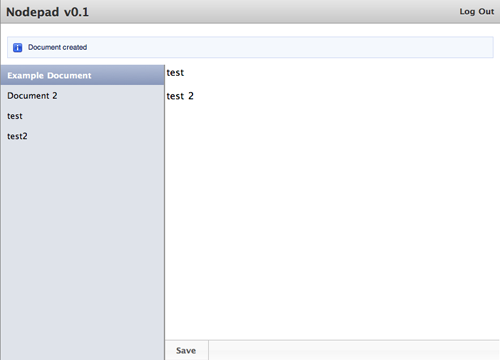

====================================
Flash-сообщения и helper'ы в Express
====================================

Добро пожаловать в восьмую часть руководства по созданию веб-приложения
с помощью **Node.js**. В рамках серии уроков будет рассказано про основные
особенности и трудности, которые возникают при работе с Node.js.

Предыдущие части:

- :doc:`node-tutorial-1`
- :doc:`node-tutorial-2`, коммит: `4ea936b`_
- :doc:`node-tutorial-3`, коммит: `39e66cb`_
- :doc:`node-tutorial-4`, коммит: `f66fdb5`_
- :doc:`node-tutorial-5`, коммит: `03fe9b2`_
- :doc:`node-tutorial-6`, коммит: `f2261c5`_
- :doc:`node-tutorial-7`, коммит: `929f564`_

.. _4ea936b: https://github.com/alexyoung/nodepad/tree/4ea936b4b426012528fc722c7576391b48d5a0b7
.. _39e66cb: https://github.com/alexyoung/nodepad/tree/39e66cb9d11a67044495beb0de1934ac4d9c4786
.. _f66fdb5: https://github.com/alexyoung/nodepad/tree/f66fdb5c3bebdf693f62884ffc06a40b93328bb5
.. _03fe9b2: https://github.com/alexyoung/nodepad/tree/03fe9b272fea1beb98ffefcf5f7ed226c81c49fd
.. _f2261c5: https://github.com/alexyoung/nodepad/tree/f2261c510c987b35df1e6e000be6e1e591cd9d6d
.. _929f564: https://github.com/alexyoung/nodepad/tree/929f5642ca1b2fa664df517457e056c92490d892

Flash-сообщения
===============

Flash-сообщения — это серверные сообщения, которые отображаются только
один раз. Для хранения таких сообщений обычно используется сессия. После
того, как сообщение показано, оно удаляется. Express поддерживает
flash-сообщения через `middleware Connect'a`_:

.. code-block:: javascript

    req.flash('info', '%s items have been saved.', items.length);

.. _middleware Connect'a: http://extjs.github.com/Connect/flash.html

Первым параметром является категория сообщения. Я обычно связываю его с
CSS классом, чтобы выводить сообщения об ошибках, отличающихся от
обычных сообщений. Вторым параметром является сообщение, которое будет
отображено. В нем можно использовать форматтеры (по умолчанию доступно
только ``%s``).

.. note::
    На данный момент функциональность flash-сообщений `переехала`_ в
    Express и `не является`_ частью Connect.

.. _переехала: https://github.com/visionmedia/express/blob/master/lib/request.js#L211
.. _не является: http://dailyjs.com/2011/01/03/node-tutorial-8/#comment-123538902

Helpers
=======

Express предоставляет два вида helper'ов: статические и динамические.
Сам helper может быть переменной или функцией и добавляется в приложение
следующим образом:

.. code-block:: javascript

    app.helpers({
      nameAndVersion: function(name, version) {
        return name + ' v' + version;
      },

      appName: 'Nodepad',
      version: '0.1'
    });

Я предпочитаю создавать отдельный файл — ``helpers.js``. И использовать
его по мере необходимости:

.. code-block:: javascript

    app.helpers(require('./helpers.js').helpers);

В Jade использовать helper можно следующим образом:

.. code-block:: javascript

    #{nameAndVersion(appName, version)}

Я добавил это в заголовок *Nodepad*'a.

Динамические helper'ы предоставляют доступ к объектам ``req`` и ``res``,
что означает, что мы можем их использовать для доступа к нашим
flash-сообщениям. Далее я покажу, как использовать динамические
helper'ы для вывода flash-сообщений.

**Обратите внимание**, что динамические helper'ы отрисовываются перед
отрисовкой шаблона, что приводит к тому, что они доступны в виде
переменных, а не функций. Это может ввести в заблуждение.

Добавление flash-сообщений
==========================

Нам нужен helper для вывода всплывающих сообщений. Добавим следующий код
в ``helpers.js``:

.. code-block:: javascript

    exports.dynamicHelpers = {
      flashMessages: function(req, res) {
        var html = '';
        ['error', 'info'].forEach(function(type) {
          var messages = req.flash(type);
          if (messages.length > 0) {
            html += new FlashMessage(type, messages).toHTML();
          }
        });
        return html;
      }
    };

Для каждого типа сообщения в цикле создается flash-сообщение с помощью
``FlashMessage``. Это новый класс, который я сделал, чтобы облегчить
использование стилей jQuery UI:

.. code-block:: javascript

    function FlashMessage(type, messages) {
      this.type = type;
      this.messages = typeof messages === 'string' ? [messages] : messages;
    }

    FlashMessage.prototype = {
      get icon() {
        switch (this.type) {
          case 'info':
            return 'ui-icon-info';
          case 'error':
            return 'ui-icon-alert';
        }
      },

      get stateClass() {
        switch (this.type) {
          case 'info':
            return 'ui-state-highlight';
          case 'error':
            return 'ui-state-error';
        }
      },

      toHTML: function() {
        return '
' +
               '
' +
               '
' + this.messages.join(', ') + '
' +
               '
' +
               '
';
      }
    };

Для каждого типа мы можем получить одно или несколько flash-сообщений. Новый
класс это понимает и выводит все сообщения через запятую.

Использование нового класса сильно упростило helper ``flashMessages``:
с помощью ``switch`` получается необходимый CSS класс в зависимости
от типа сообщения. Далее создается HTML код, который уже прекрасно
взаимодействует с кодом jQuery UI:

.. image:: ../../public/img/jquery-ui-login.png
   :align: center
   :alt: Окно входа в nodepad. Из сериии уроков по node.js

Чтобы загрузить динамический helper в приложение (``app.js``), необходимо
сделать следующее:

.. code-block:: javascript

    app.dynamicHelpers(require('./helpers.js').dynamicHelpers);

Далее, необходимо найти места в коде, где необходим вывод flash-сообщений.
Например, так:

.. code-block:: javascript

    app.post('/sessions', function(req, res) {
      User.find({ email: req.body.user.email }).first(function(user) {
        if (user && user.authenticate(req.body.user.password)) {
          req.session.user_id = user.id;
          res.redirect('/documents');
        } else {
          req.flash('error', 'Неверные данные');
          res.redirect('/sessions/new');
        }
      });
    });

И, наконец, добавляем helper в шаблон ``views/layout.jade``:

.. code-block:: javascript

    #{flashMessages}

Проблемы вывода сообщений
=========================

Единственная проблема в текущем коде состоит в том, что он не соответствует
дизайну редактора:­

Чтобы исправить ситуацию, необходимо добавить немного CSS (``styles.less``):

.. code-block:: css

    .flash {
      position: absolute;
      top: 0;
      bottom: 0;
      z-index: 1001;
      width: 100%;
      opacity: 0.75;
      background-color: #111;
    }

    .flash span {
      float: left;
      margin-right: .7em;
    }

    .flash .ui-corner-all {
      width: 300px;
      margin: 50px auto 0 auto;
      padding: 0 5px;
      opacity: 0.9;
      font-weight: bold;
      -moz-box-shadow: 0 0 8px #111;
      -webkit-box-shadow: 0 0 8px #111;
      box-shadow: 0 0 8px #111;
    }

В результате, при выводе flash-сообщения основная страница уйдет в тень.
Чтобы скрыть сообщение, я добавил в ``application.js`` следующее:

.. code-block:: javascript

    function hideFlashMessages() {
      $(this).fadeOut();
    }

    setTimeout(function() {
      $('.flash').each(hideFlashMessages);
    }, 5000);
    $('.flash').click(hideFlashMessages);

Заключение
==========

Express предоставляет статические и динамические helper'ы. Динамические
отрисовываются перед отрисовкой основного шаблона, и в них доступны
объекты ``req`` и ``res``. В шаблоне helper'ы доступны в виде переменных.

Как правило, создают отдельный файл под helper'ы, который при необходимости
загружают в приложение через ``require``.

Я сделал класс ``FlashMessage``, чтобы показать, почему полезно использовать
отдельный файл для helper'ов, а так же ненароком продемонстрировал работу
с геттерами и ООП в JavaScript. Быть может, вам покажется предпочтительнее
реализовать это передавая flash-сообщения в шаблоны через динамические
helper'ы. В результате, вывод flash-сообщений может быть реализован
с помощью Jade, а не на HTML, как в моем варианте. Попробуете реализовать?

Текущая версия *Nodepad*'a «лежит» в коммите `df0b954`_.

.. _df0b954: https://github.com/alexyoung/nodepad/tree/df0b954b3c4e83a69ab4cfe2d87f2fb1d0ffa162
